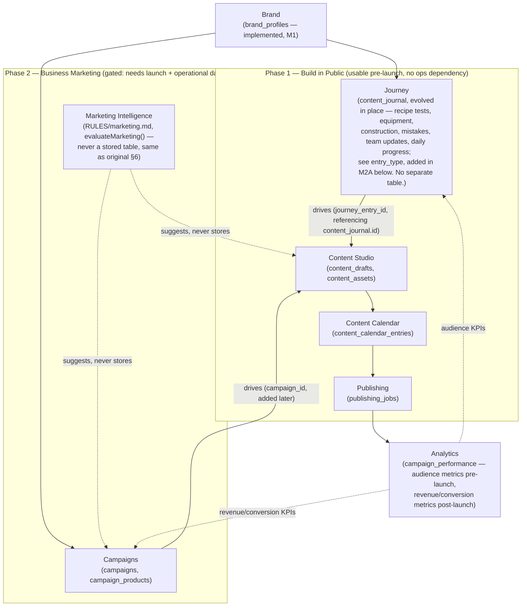
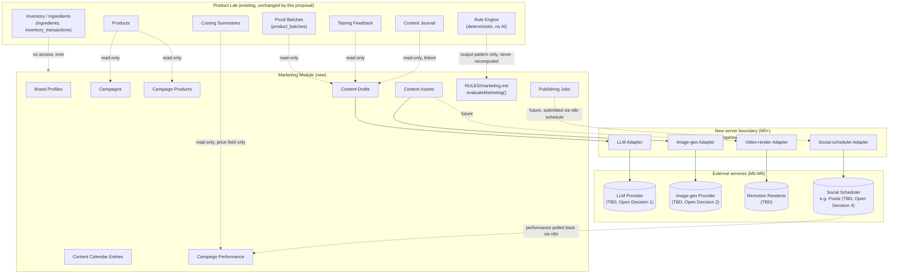
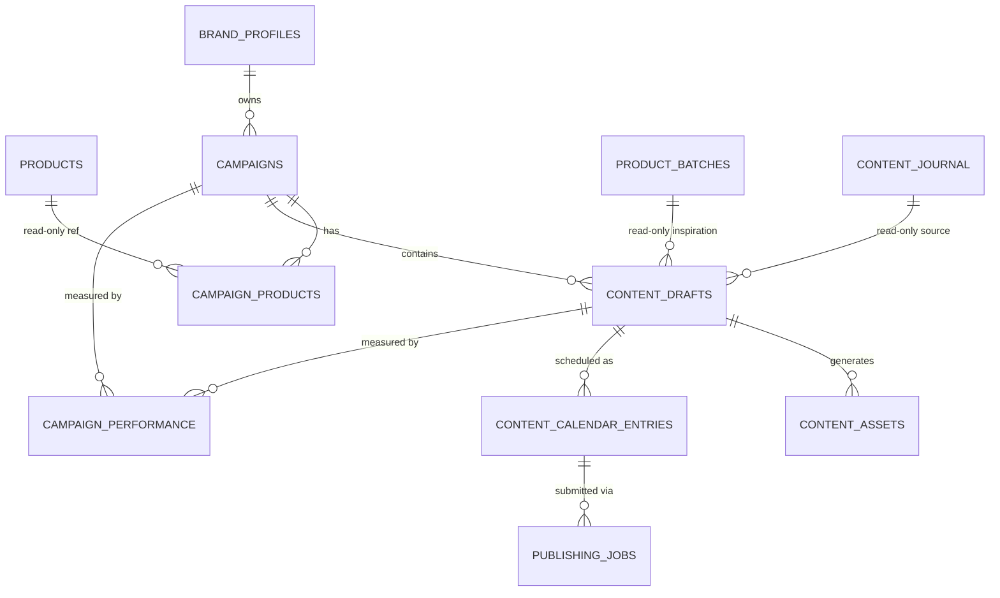

# Marketing Module — Architecture Proposal (M0 + M1 + M1.5 review + Journey audit + M2A/M2B/M2C1/M2C1.5/M2C2 status)

> **Status: M0 (architecture/discovery) complete. M1 narrowed, approved, and implemented —
> Brand Profile persistence only. Architectural review completed before Campaigns (M1.5) — see
> "Architectural Review" section below. Journey/`content_journal` readiness audit completed before
> writing any Journey schema — see "Journey / `content_journal` Readiness Audit" section below.
> M2A (Journey persistence foundation — `entry_type` added to `content_journal`, no new table)
> approved and implemented 2026-07-27 — see "M2A implementation record" section below and
> `planning/PROPOSALS.md` PROP-014. M2B (Journey Capture UI — optional product association, entry-type
> picker, Journal→Journey terminology, on branch `feat/journey-capture-ui-m2b`) implemented
> 2026-07-28 — see "M2B implementation record" section below. M2C1 (Content persistence foundation
> — `content_drafts` table, nullable `journey_entry_id` link, no UI/wiring) implemented 2026-07-28
> — see "M2C1 implementation record" section below and `planning/PROPOSALS.md` PROP-016. M2C1.5
> (Content Studio UX contract — design audit only, no code) completed 2026-07-28 — see "M2C1.5 —
> Content Studio UX Contract" section below. M2C2 (Journey → Content handoff UI — the
> `createDraftFromJourney`/`saveDraft` pipeline, the Create content button, the real Content
> Studio screen, on branch `feat/journey-content-handoff-ui-m2c2`) implemented 2026-07-28 — see
> "M2C2 implementation record" section below and `planning/PROPOSALS.md` PROP-017. Next: Duplicate
> draft, AI generation, or Campaign linkage (once Campaigns exists) — none committed to yet.**
> Written 2026-07-25 (M0). Updated 2026-07-27: the owner approved a narrowed M1 covering
> **Brand Profile only** — no `campaigns`, `campaign_products`, or any later-milestone table.
> See `planning/PROPOSALS.md` PROP-012 for the approval record and PROP-013 for the remaining,
> still-Parked scope (Campaigns onward). The schema in §6 below reflects what was actually
> built, not the original M0 draft — see the "M1 scope note" at the top of §6.
> This extends `PRODUCT_LAB_CONTEXT.md`'s one existing mention of marketing (under Content
> Journal: *"Converts proof work into marketing assets and ideas"*).
> **Updated again 2026-07-27 (same day): before starting Campaigns, the owner asked for a review
> of whether this whole module assumed the wrong lifecycle shape.** It did, partially — see the
> "Architectural Review" section directly below the M1 implementation record. That review
> introduces **Journey** as a first-class domain and revises the sequencing in §3/§4/§5/§6/§7/§14/
> §15/§16 (each still shown with its original text, not rewritten — the review section states what
> changes and why, so the reasoning trail stays intact). It is a **proposal only**: no schema,
> table, migration, or code was added or changed as part of it.
>
> Grounded entirely in the current repo state (code + `.sql` files + docs), not assumptions.
> Where a claim below is a judgment call rather than a fact, it's labeled **Recommendation**
> — everything else is a verified fact about the current codebase.

---

## M1 implementation record (2026-07-27)

Thirteen decisions narrowed and approved M1 (full record in the task that produced this
update; summarized here for anyone reading this file later):

1. M1 covers **Brand Profile only** — not the brand+campaign schema originally sketched in §6/§16.
2. `campaigns`, `campaign_products`, content drafts, calendar entries, generation/publishing jobs,
   recommendations, and performance tables are explicitly **not** part of M1.
3. The product-identity question (Open Decision 8 below) does **not** block M1, because Brand
   Profile has no product dependency.
4. The app supports **one active brand profile** for the whole business — there is no
   workspace/multi-client model, and none was invented (see §8/§10 below).
5. The schema stays extensible for multiple (historical/inactive) profile rows later, but no
   agency/multi-client/multi-workspace behavior was built now.
6. Logos use Supabase Storage **in a future migration** — this milestone stores only a nullable
   `logo_storage_path` reference, no bucket, no binary data (see §6, §9's non-goals).
7. LLM/image-gen/video-render/social-scheduler providers remain fully deferred — no adapters,
   no SDKs, no external calls in M1.
8. No server execution boundary was added — this is CRUD-only schema work.
9. Marketing recommendations still begin with deterministic rules in a later milestone (§6's
   original `evaluateMarketing()` recommendation is unchanged, just not built yet).
10. Social publishing stays approval-first in later milestones (unchanged from §7's original
    lifecycle design, not yet built).
11. **Product identity resolution** (Open Decision 8) is now directionally answered: persisted
    database `products` rows are the intended long-term source of truth. Whether the current
    product domain is actually ready for campaign foreign keys is a **separate audit**, to run
    before M2 (Campaigns). This task did not touch product identity at all.

---

## Architectural Review — Journey as a First-Class Domain (2026-07-27)

Triggered by the owner, before any Campaigns work (M1.5) begins. During M1 it became clear the
business's marketing goals are broader than traditional marketing: the business has two distinct
lifecycle phases, and the original M0 draft assumed the second one's shape from the beginning.

**Phase 1 — Build in Public (pre-launch).** Goal: audience building, not selling. Brand design,
Product Lab development, recipe testing, equipment selection, construction/setup, coffee
experiments, mistakes and lessons, daily progress, team updates.

**Phase 2 — Business Marketing (post-launch).** Goal: business growth using operational data.
Product promotions, inventory-driven campaigns, high-margin recommendations, seasonal promotions,
loyalty campaigns, AI-generated marketing recommendations.

This section is the requested review. **It is a proposal only** — no schema, table, migration, or
code change is included here or was made while writing it. It revises how §3–§7 and §14–§16 below
should be read going forward; §1/§2 (current-state facts) and the M1 implementation record above
are unaffected.

### The concrete problem this surfaces

Under the original draft, `content_drafts.campaign_id` is a foreign key into `campaigns` (§6).
Even though the column is nullable, **the migration that creates `content_drafts` cannot run until
the `campaigns` table exists** — a Postgres FK needs its target table to be there at creation time.
That is exactly why §16's original sequence has M3 (Content Drafts) depending on M1.5 (Campaigns
schema), which is itself blocked on the still-unscheduled product-readiness audit.

But **100% of pre-launch content is Phase-1, build-in-public storytelling** — recipe testing,
equipment, construction, coffee experiments, mistakes, daily progress, team updates. None of it has
a campaign, a target product being pushed, or a commercial goal. Every one of those rows would ship
with `campaign_id` null for the entire pre-launch period. As drafted, **Content Studio is blocked on
a domain (Campaigns) that none of its near-term rows will ever reference** — the schema-level
symptom of designing Phase 2's shape first.

### Answering the nine questions

**1. Difference between Journey, Content, and Campaign.** Three different kinds of things, not
three names for one:
- **Journey** — the *narrative* domain. A durable record that something really happened while
  building the business (a batch test, an equipment purchase, a mistake, a team milestone). No
  commercial goal, no target product required. Source material, not a finished artifact.
- **Content** — the *production* domain. The actual creative artifact (drafted text, image, video),
  regardless of why it exists. Content Studio's job is authoring/generating/reviewing, not deciding
  strategy.
- **Campaign** — the *commercial-goal* domain. A bounded push tied to a business objective (promote
  product X, clear surplus of Y, seasonal push, loyalty push), with a start/end date and a target.
  Only meaningful once there's a product/inventory/sales reality to aim at.

  The relationship: **Journey and Campaign are two independent, optional *drivers* of Content** —
  not a hierarchy where Campaign is the parent of everything. Pre-launch, every Content row is
  Journey-driven and zero are Campaign-driven; post-launch, both drivers coexist side by side.

**2. Photos and videos.** Split by lifecycle stage, not owned by one domain. *Raw capture* (a
proof-batch photo, a construction photo) stays with its originating operational domain — Batches'
existing `batch-photos` bucket, or Journey's own capture — Content never owns raw kitchen/site
photos. The *produced, publish-ready* asset (a finished Reel, a designed carousel image) is Content
Studio's (`content_assets`), generated from — but not replacing — the raw source.

**3. AI-generated scripts.** Content Studio, unchanged from the original draft. `content_drafts`
(reel_script/carousel/caption + `generation_provider`/`generation_model_version`/`generation_prompt`
provenance) is correctly scoped here regardless of whether a Journey entry or a Campaign requested
it.

**4. Publishing status.** A distinct Publishing domain — not Content, not Campaigns. Content's
status stops at `approved`; from there, Content Calendar (`content_calendar_entries.status`) and
Publishing (`publishing_jobs.status`) take over the platform-submission lifecycle. This three-way
split was already correct in the original §7 — it doesn't need to change, it just needs Journey and
Campaign to sit *above* it as parallel drivers instead of Campaign being the only one.

**5. Performance metrics.** Analytics, sitting after Publishing. Mechanically the same table shape
either way (impressions/reach/likes/etc. per published item), but the *meaning* differs by driver:
Journey-driven content rolls up to audience/brand growth (followers, engagement, reach);
Campaign-driven content rolls up to campaign performance, and **only** Campaign-driven rows ever get
`revenue_attributed` — Journey content was never trying to sell anything, so a revenue field on it
would be a fabricated number (the same "never invent a number" discipline the Rule Engine already
applies via `passed: null`).

**6. Must exist before launch.** Brand, Journey, Content Studio, Content Calendar, and Publishing
(and Analytics, mechanically — audience metrics need no sales data). A pre-launch business
genuinely benefits from documenting its build, producing content about it, scheduling it,
publishing it, and watching audience response, with zero transactions. What must **not** exist
pre-launch: Campaigns (no commercial goal to aim at) and Marketing Intelligence (no inventory/sales
data to compute a recommendation from).

**7. Depends on inventory and sales.** Campaigns (needs product/inventory reality to target — "push
this because we have surplus") and Marketing Intelligence (needs inventory + costing + sales to
generate a recommendation at all). Nothing else in the stack touches inventory or sales.

**8. Fully independent of business operations.** Brand, Journey, Content Studio, Content Calendar,
Publishing. None require `products`, `inventory`, or a sales table to function; they may optionally
read Proof Batches/Tasting/Content Journal as inspiration, never as a hard dependency.

**9. Does the M0 proposal need restructuring.** Yes, but narrowly — not a rewrite. The table
shapes, the adapter-boundary pattern (§9), the RLS/migration conventions, and the Content/Calendar/
Publishing status-machine split already sketched in §6/§7 are still correct and are **kept**. What
changes is the *sequencing and coupling*:
- Journey becomes a first-class, independent domain — not a rename of `content_journal` (see Open
  Decision 13 below).
- Content's driver becomes polymorphic: a `journey_entry_id` FK now, a `campaign_id` FK added
  *later* by its own additive migration once Campaigns actually exists — matching this repo's
  `add column if not exists` convention exactly, so nothing already built needs reworking when
  Campaigns ships.
- The milestone table is reordered so the whole Phase-1 stack (Journey → Content Studio → Content
  Calendar → Publishing) can ship and be used **before** Campaigns/Marketing Intelligence, instead
  of being gated behind them.

### Revised layered architecture



> **Correction (2026-07-27, closeout review):** the "Journey" node above originally read
> `(new: journey_entries — ...)` when this diagram was first drawn, before the readiness audit
> below inspected the actual schema/code. It has been corrected in place to say what actually
> shipped: **`content_journal` evolved, no new table** — see the "Journey / `content_journal`
> Readiness Audit" and "M2A implementation record" sections for the full resolution. Everything
> else in this diagram (Phase 1/Phase 2 split, Content Studio/Calendar/Publishing/Analytics/
> Campaigns/Marketing Intelligence shapes) is unaffected by that correction.

### What this changes below, section by section

- **§3 (summary)** — the Marketing module is no longer one flat set of tables read by Campaigns;
  it's two independently-shippable stacks (Phase 1: Journey/Content/Calendar/Publishing; Phase 2:
  Campaigns/Marketing Intelligence) sharing Content/Calendar/Publishing/Analytics as a common spine.
- **§4/§5 (diagrams)** — `CAMPAIGNS ||--o{ CONTENT_DRAFTS : contains` is no longer the accurate
  primary relationship; read it as superseded by Journey and Campaigns being two parallel, optional
  drivers (diagram above).
- **§6 (tables)** — ~~add `journey_entries` (new, not built) to the table list~~ — **corrected by
  the Readiness Audit/M2A below: no new table.** `content_journal` itself gains an additive
  `entry_type` column for build-in-public moments that don't already have a home (equipment,
  construction, team, general progress) — implemented, see M2A. Batch-tied and kitchen-capture
  moments keep coming from `product_batches`/`content_journal` read-only, unchanged.
  `content_drafts`'s first migration (still not built) carries only `journey_entry_id` (referencing
  `content_journal.id`), not `campaign_id` — `campaign_id` arrives later, additively, once Campaigns
  ships. `product_id` stays optional/descriptive on `content_drafts` regardless of the
  product-readiness audit — Content never requires a resolved product FK the way
  `campaign_products.product_id` does.
- **§7 (lifecycle)** — unchanged for `content_drafts`/`content_calendar_entries`/`publishing_jobs`.
  ~~Add a simple `journey_entries` lifecycle~~ — **corrected: `content_journal`'s own lifecycle**
  stays plain CRUD (see the Readiness Audit), extended conceptually as `captured → (spawns one or
  more content_drafts over time)`. It carries no approval gate of its own — Aly/Shin's existing
  review still happens at the Content Draft stage, same as today.
- **§14 (non-goals)** — add: don't rename or restructure `content_journal` as part of this review;
  it keeps its exact existing kitchen-capture role, read-only, unchanged. Journey is additive, not a
  replacement.
- **§15 (open decisions)** — add two, numbered 13–14 below.
- **§16 (milestone sequence)** — reordered below so Phase 1 no longer depends on Campaigns or the
  product-readiness audit at all.

### Two new open decisions (owner approval required, same as §15)

13. ~~**Does `journey_entries` subsume `content_journal`, or sit beside it?**~~ — **resolved
    2026-07-27** by the "Journey / `content_journal` Readiness Audit" section above, after actually
    inspecting the schema and code: neither — **`content_journal` becomes Journey directly**, no
    third table. The audit found the DB already supports everything reuse needs (nullable
    `product_id`/`batch_id`, headroom for an additive `entry_type` column); the original "beside it"
    recommendation below was made before that inspection and is superseded.
    ~~Recommendation: beside it, at least initially — `content_journal` stays Aly's low-friction
    kitchen-capture flow (unchanged, per the existing non-goal); `journey_entries` covers moments
    that have no existing table (equipment, construction, team, general progress). Journey's "feed"
    is a read-only aggregation across both, not a new capture form replacing either.~~
14. **Does Journey ship as its own milestone before Content Studio, or bundled into the same
    migration?** Recommendation: bundled — they're both needed together for the Phase 1 stack to be
    usable at all (a Journey entry with nothing to turn it into is just Content Journal again).

### Revised milestone sequence (supersedes §16's ordering; §16's original table is left below for
the reasoning trail, not deleted)

| # | Delivers | Depends on | Phase | Touches external services? | Safe to greenlight now? |
|---|---|---|---|---|---|
| M1 | `brand_profiles` — **implemented** | — | Both | No | Done |
| **M2A** *(renamed from the "M1J" placeholder above once the readiness audit ruled out a new table; renumbered by the owner — see the M2A implementation record below)* | `entry_type` column added to the existing `content_journal` table — **no new table** — **implemented** | M1 | Phase 1 | No | Done |
| **M2B** *(next)* | Journey capture UI: optional product association, entry-type picker, nav label | M2A | Phase 1 | No | Not started |
| **M2J** *(renumbered from the old M3)* | `content_drafts`/`content_assets` schema + UI, `journey_entry_id` only (no `campaign_id` column yet) | M2A/M2B | Phase 1 | No | **Yes** — fully decoupled from Campaigns |
| **M3J** *(renumbered from the old M4)* | `content_calendar_entries` + calendar view | M2J | Phase 1 | No | **Yes** |
| **M4J** *(new — the manual-publish half of the old M9, pulled forward)* | `publishing_jobs` schema, manual-publish-confirmation only | M3J | Phase 1 | No | **Yes** |
| M1.5 | `campaigns`/`campaign_products` schema | M1, the product-readiness audit (Open Decision 8) | Phase 2 | No | **No** — unchanged, still waiting on that audit |
| M2 | Campaigns CRUD UI | M1.5 | Phase 2 | No | Yes, once M1.5 lands |
| **M5C** *(new, additive)* | `alter table content_drafts add column campaign_id` — the moment Content Studio starts serving Campaigns too | M1.5, M2J | Phase 2 | No | Yes, once M1.5 lands — one additive migration, no rework of M2J |
| M5 | Server boundary (`app/api/`) | M2J–M4J for Phase-1 use cases, or M1.5 for Phase-2 use cases | Both | Infra only | **No** — still needs an explicit "yes, now" |
| M6/M7 | LLM / image-gen adapters | M5 | Both | Yes | **No** — blocked on vendor + budget decisions, unchanged |
| M8 | `RULES/marketing.md` + `evaluateMarketing()` = Marketing Intelligence | M1.5 (needs Campaigns/inventory context to mean anything) | Phase 2 | No | **No** — Phase 2 only; the original table listed this as buildable in parallel with M6/M7, which assumed Phase 2's shape too early |
| M9 | Scheduler integration + `campaign_performance` revenue fields | M5, chosen scheduler | Phase 2 | Yes | **No** — unchanged |

**Net effect:** the Phase 1 stack (Journey, Content Studio, Content Calendar, Publishing — M1J
through M4J) is now buildable and usable immediately, with zero dependency on the product-readiness
audit or any Campaigns decision. Nothing about Phase 2 (M1.5 onward) changes from the original
sequencing — it stays exactly as gated as before.

---

## Journey / `content_journal` Readiness Audit (2026-07-27)

Triggered before writing any Journey schema, per the approved flow **Journey and/or Campaign →
Content Studio → Content Calendar → Publishing → Analytics**, where Journey and Campaign are two
independent, optional sources of Content (a future content record may reference a Journey entry, a
Campaign, both, or neither for standalone manual content). This is an **audit only** — no
migration, no new table, no code, no UI, and no package was added or changed while producing it.
Everything below is grounded in the current repo state (`supabase-schema.sql`,
`supabase-update-costing-and-journal.sql`, `supabase-fix-permissions.sql`, `src/lib/product-lab-
types.ts`, `src/lib/lab-state.ts`, `src/app/product-lab.tsx`, `src/app/content-studio/page.tsx`,
`src/components/product-controls.tsx`, `src/components/recent-entries.tsx`,
`src/components/app-shell.tsx`, `RULES/product-development.md`, `tests/`) — not assumptions.

### Current-state summary

`content_journal` is a real, actively-used Postgres table, defined in the original
`supabase-schema.sql` (not a later `supabase-add-*.sql` increment — it predates the one-file-per-
increment convention used by every newer table). It has been touched twice since, in
`supabase-update-costing-and-journal.sql` and `supabase-fix-permissions.sql` — both are grant/RLS-
policy fixes only; its column shape has never changed since it was created.

### Existing data flow

1. **Load** — `product-lab.tsx`'s `loadSupabaseData()` runs `supabase.from("content_journal")
   .select("*").order("created_at", { ascending: false })` once per session load, alongside every
   other domain table, then maps rows into `LabState.journal: ContentJournalEntry[]`.
2. **Save** — `saveJournal(formData)` builds one `ContentJournalEntry`, then either
   `.update(payload).eq("id", journalId)` or `.insert(payload)` against `content_journal`, and
   reloads all data afterward.
3. **Delete** — `deleteJournal(journalId)` runs a hard `.delete().eq("id", journalId)` — no soft-
   delete/recycle-bin (the same app-wide gap PROP-009 addresses for Inventory; not yet extended
   here).
4. **Read consumers** — the `/journal` screen's own recent-entries list; the Dashboard's journal
   count metric; Product Detail's "Content Signals" card (latest entry's `postIdeas`/
   `mediaCaptured`/`nextAction` for that product); and `/content-studio`'s stub (below).

All of this is client-side (`"use client"`), talking to Supabase directly with the anon key — no
server boundary, consistent with every other domain in this app (MARKETING_MODULE.md §1).

### Current ownership and lifecycle

**Schema (13 real columns + `id`):** `product_id` (nullable FK → `products`, `on delete set null`),
`batch_id` (nullable FK → `product_batches`, `on delete set null`), `entry_date` (date, default
`current_date` — date only, no time-of-day), `what_was_made`, `what_was_tested`, `media_captured`,
`reactions`, `lesson_learned`, `post_ideas`, `reel_ideas`, `caption_draft`, `next_action`,
`created_at`/`updated_at`. RLS: `using (true) to authenticated` / `with check (true)` — identical
to every other table, no special protection.

**What the app layer actually uses — 8 of those 13 columns.** `ContentJournalEntry`
(`src/lib/product-lab-types.ts:115`) models only `id`, `productId`, `entryDate`, `whatWasMade`,
`mediaCaptured`, `lessonLearned`, `postIdeas`, `nextAction`. The load-mapping (`product-lab.tsx`
line 335) and the save payload (lines 1782-1790) both confirm this exactly. **`batch_id`,
`what_was_tested`, `reactions`, `reel_ideas`, and `caption_draft` are dead columns** — present in
the database, never read or written by any code path in `src/`.

**UI — two consumers, very different maturity:**
- **`/journal`** (real, production CRUD screen) — `JournalForm` captures: Product (**required** —
  see the product-mandatory finding below), capture date, a "Best use" content-angle select (7
  fixed options: product proof / behind the scenes / packaging test / tasting feedback / lesson
  learned / launch teaser / not content-worthy — stored in `post_ideas`), a free-text "Moment
  captured" field (`what_was_made`), a 6-option media *checklist* (texture close-up / process clip /
  final product photo / packaging photo / taster reaction / no usable media — descriptive tags, not
  file uploads), an optional external media-location link (Google Drive folder / phone album /
  local path, concatenated into the same `media_captured` text), a lesson/note field, and a
  next-action field. **No status or lifecycle field appears anywhere in the form.**
- **`/content-studio`** — confirmed still a stub, matching MARKETING_MODULE.md §1's original
  finding exactly: `ContentStudio()` (`product-lab.tsx:2761`) derives three template-string cards
  (Reel/Carousel/Caption) from `labState.journal[0]` — whichever journal row is most recently
  *created* across the entire app, not scoped to a product or explicitly selected. No persistence,
  no edit, no AI call, no generation status, no `content_drafts`-shaped record of any kind.

**Lifecycle today: plain CRUD only** — created → edited any number of times → hard-deleted. No
draft/reviewed/published states, no content-generation status, no publishing status. That absence
is **correct**, not a gap, under the approved boundary: those responsibilities belong to Content
Studio, Calendar, and Publishing, not Journey.

**Not wired into the Rule Engine.** One prose mention in `RULES/product-development.md` (line 72)
describes journal entries as a free-text signal for "is this experiment complete," explicitly named
in that doc as a data gap — not an active, computed input in `src/lib/rule-engine/*.ts` today.

**Zero test coverage.** No file in `tests/` references `content_journal` or `ContentJournalEntry`.

**Production-real, not experimental.** `/journal` is one of Aly's three named low-friction flows in
`PRODUCT_LAB_CONTEXT.md` and holds genuine historical data other screens depend on (Dashboard
metric, Product Detail content signals). `/content-studio` is the one stub in this pair.

**Answering the schema-checklist directly (prompt Q7):**

| Capability | Status |
|---|---|
| Text notes | Yes — `what_was_made`, `lesson_learned`, `next_action` |
| Dates and timestamps | Partial — `entry_date` is date-only (no time-of-day); `created_at`/`updated_at` track record save time, not the captured moment's time |
| Categories or entry types | **No** — `post_ideas` ("Best use") answers *how this becomes content*, not *what kind of real-world moment this was*; those are different questions this schema currently conflates into one field |
| Photos or videos | **No file storage** — `media_captured` is descriptive tags + an optional external link (Drive folder, phone album, local path); nothing is uploaded to Supabase Storage the way Batches' photos are |
| Links to batches/products/formulas | Partial — `product_id` and `batch_id` columns exist, but only `product_id` is actually wired into the app; `batch_id` is dead (see above); no formula link exists or is implied |
| Content-generation status | No — correctly out of scope for Journey under the approved boundary |
| Publishing status | No — correctly out of scope for Journey under the approved boundary |

**The product-mandatory finding (the real blocker for Journey's broader scope).**
`ProductSelect` (`src/components/product-controls.tsx:4`) renders a plain `<select>` over
`sample-data.ts`'s hardcoded product array with **no blank/"none" option** — every journal entry
submitted through the real UI always carries a product id, even though the underlying DB column is
nullable (`on delete set null`). The schema already permits a product-independent entry; the UI
simply never offers that path. This is the concrete reason `content_journal` can't yet capture
equipment selection, construction/setup, team updates, or general daily progress — moments the
Journey brief explicitly requires and that have no natural product to attach to.

### Reuse-versus-replace analysis

**For reuse (evolve `content_journal` → Journey):**
- Already covers 4 of the 5 requested capture primitives (text notes, dates, product/batch links,
  next-action) with **zero schema change** — `batch_id` merely needs reviving in code, it already
  exists in the database.
- `product_id`/`batch_id` are already nullable at the DB layer — broadening to product-independent
  moments is a UI change, not a migration.
- It is real, exercised, production code with real historical data that must be preserved — not a
  greenfield table starting from nothing.
- A parallel `journey_entries` table would duplicate note/date/media-reference fields this table
  already has, and every future reader would need to know which of two tables a given "moment"
  landed in — exactly the blurry-duplicate-domain outcome the decision criteria warns against.

**Against reuse — checked, and none hold up:**
- *"Its semantics are irreversibly product-first."* Not true at the schema level; only the UI
  enforces that today, and that's a form change, not a structural one.
- *"A new column would disrupt Aly's existing low-friction flow."* An additive, nullable
  `entry_type` column changes no existing field, screen, or workflow step.
- *Five dead columns suggest an earlier, wider intention that was abandoned.* True, and worth
  naming as a risk (below) — but it's a naming/dead-code hygiene issue, not a reason the table can't
  safely become Journey.

**Conclusion: reuse is safe and preferred.** No new table is genuinely necessary.

### Recommended canonical domain name

**"Journey"** at the conceptual/product level, matching the Architectural Review's terminology and
the business's build-in-public framing. **Keep the DB table name `content_journal` unchanged** —
this repo already accepts a table whose name doesn't match its current conceptual role
(`product_batches` stays named that even though `PRODUCT_LAB_CONTEXT.md` describes it functionally
as "the production run"); a rename-only migration adds risk for zero behavior change. Renaming the
TypeScript type (`ContentJournalEntry` → `JourneyEntry`) and the nav label ("Content Journal" →
"Journey") are reasonable follow-ups for the *implementation* milestone — explicitly not done as
part of this audit.

### Recommended table strategy

**No new table.** Evolve `content_journal` in place, additively, in a future milestone:
1. `alter table content_journal add column if not exists entry_type text` — nullable, no DB check
   constraint (matches this schema's existing status-column convention), TS-enforced small
   vocabulary (e.g. `recipe_test` / `equipment` / `construction` / `coffee_experiment` /
   `mistake_lesson` / `team_update` / `daily_progress` / `other`) — a genuinely new field, distinct
   from `post_ideas`'s existing "Best use" content-angle purpose, not a replacement for it.
2. Revive `batch_id` in `ContentJournalEntry` and the load/save mapping — a code change, not a
   migration; the column already exists.
3. Decide the fate of `what_was_tested`/`reactions`/`reel_ideas`/`caption_draft` explicitly — wire
   them in if still wanted, or drop them in a later, named cleanup migration. Do not silently build
   Journey logic on top of columns nobody currently reads.

### Data-preservation and migration implications

Every existing `content_journal` row must stay readable and editable exactly as today. The
recommended migration is purely additive (`add column if not exists`, matching every existing
migration's own convention in this repo) and touches no existing column — no backfill, no data
transformation. Existing rows would simply have `entry_type is null` until an operator optionally
tags them retroactively — never inferred or guessed after the fact, matching this app's existing
"don't invent a value" discipline (the Rule Engine's `passed: null` pattern).

### Boundary between Journey and Content Studio

Unchanged from the Architectural Review's answers to Q1/Q3: Journey (the evolved `content_journal`)
owns the raw real-world moment, its descriptive media references, and lessons/next-action notes;
Content Studio owns the produced, publish-ready artifact (script, caption, carousel, shot list)
generated from a Journey entry and/or a Campaign. **`/content-studio`'s current stub already
violates this boundary in one specific, worth-naming way:** it renders caption/reel/carousel text
directly from live Journey fields in the UI layer, with no persisted `content_drafts` row and no
generation provenance — i.e., it is doing Content Studio's job by reading Journey data live instead
of owning its own record. This confirms the plan already on file (§6/§14: "`/content-studio` is
intended to be replaced... but not touched before then") is still correct; this audit adds no new
reason to touch it now.

### Risks

1. **Dead-column trap** — five unused DB columns (`batch_id`, `what_was_tested`, `reactions`,
   `reel_ideas`, `caption_draft`) mean a careless `select *`-based Journey read path could surface
   stale/legacy fields that look meaningful but were never wired to any UI, silently reviving dead
   data.
2. **Zero test coverage today** — any future evolution has no regression safety net. A shape/smoke
   test should land in the same milestone that adds `entry_type`, mirroring
   `tests/brand-profiles-schema.test.ts`'s pattern for PROP-012.
3. **No soft-delete** — `deleteJournal()` is a hard delete, the same app-wide gap PROP-009 addresses
   for Inventory. If Journey becomes the durable, business-history record, this gap becomes more
   costly than it is for a stub kitchen note today. Named for visibility, not decided here.
4. **Product-mandatory UI blocks Journey's own charter** — equipment/construction/team-update
   entries have nowhere to go until a "no product" path exists in the UI. Must be resolved before
   Journey can cover what the brief actually asks for, but it's a UI change, correctly deferred past
   this audit.
5. **`/content-studio`'s implicit coupling to `journal[0]`** will need a clean cutover — not a
   parallel path — once real `content_drafts` exist, or the app ends up with two disagreeing
   "what's the latest content idea" surfaces.

### Explicit non-goals (this audit)

No migration was written. No `journey_entries` or any Content Studio/Campaign table was created.
No production code, navigation, or UI was modified. No package was installed. `/journal`'s and
`/content-studio`'s existing behavior is untouched. `planning/PROPOSALS.md` was not modified — this
audit's own status/decision, if the owner wants it recorded there, is a separate, later action.

### Final recommendation

**Evolve `content_journal` into the canonical Journey domain in place. Do not create a separate
`journey_entries` table.** A parallel table would duplicate fields this one already has and would
violate the decision criteria's "no blurry duplicate domains" rule. This **resolves Open Decision
13** above (added by the Architectural Review, before this audit inspected the actual schema/code):
that decision framed the question as *"does `journey_entries` subsume `content_journal`, or sit
beside it"* and recommended "beside it, at least initially." Having now inspected the real schema
and code, there is no third table in play — **`content_journal` becomes Journey directly**,
superseding that earlier, less-informed recommendation.

### Smallest next implementation milestone

**M1J — Journey-readiness migration** (naming it here, not building it): one additive SQL file
(e.g. `supabase-add-journey-entry-type.sql`) adding `entry_type text` to `content_journal`; a
TypeScript update reviving `batch_id` and adding `entryType` to the journal type; one shape/smoke
test mirroring `tests/brand-profiles-schema.test.ts`. **UI changes (making product optional, adding
an entry-type picker, renaming the nav label) are a separate, later milestone** — deliberately not
bundled here, to keep M1J small and reviewable, matching this repo's own "smallest safe slice"
precedent from M1 (Brand Profile).

---

## M2A implementation record (2026-07-27) — Journey persistence foundation

**Approved and implemented same day as the audit above.** The owner named this milestone **M2A**
(the audit above proposed it as "M1J" before naming settled — same milestone, M2A is the name of
record going forward). Delivered as `supabase-add-journey-entry-type.sql`, a `product-lab-types.ts`
update, and a new test file. No UI, no navigation, no other code path was touched. **Applied to live
Supabase and verified 2026-07-27** — see the "Live Migration Verification" section below.

- **`content_journal` is the canonical Journey persistence table.** Confirmed, not just proposed —
  this migration is the first concrete step of that evolution actually landing.
- **`journey_entries` will not be created** — neither now nor, per the audit's reuse-vs-replace
  analysis, at any later Journey milestone. There is one Journey table: `content_journal`.
- **The physical table name stays `content_journal`** for compatibility — no rename, no migration
  risk, matching every other table in this schema that outgrew its literal name in place
  (`product_batches` being the standing precedent).
- **`entry_type` is deliberately open-ended and nullable** — plain `text`, no DB `check` constraint,
  no enum. The controlled vocabulary (`recipe_test` / `equipment` / `construction` /
  `coffee_experiment` / `mistake_lesson` / `team_update` / `daily_progress` / `other`, or whatever
  the owner settles on) is an app/TypeScript-layer concern for M2B, not a database-layer one.
- **Null means legacy or unclassified** — not a real "no type" value, and never backfilled or
  inferred. Every existing `content_journal` row reads `entry_type = null` until an operator
  (optionally) tags it, exactly as the audit specified.
- **The UI will later make product association optional** — `ProductSelect`'s missing "none" option
  (the audit's concrete blocker for equipment/construction/team-update entries) is untouched in M2A.
  That is explicitly M2B's job.
- **The existing dead columns remain preserved pending Content Studio design** — `batch_id` is
  revived in the TypeScript type only (see below); `what_was_tested`, `reactions`, `reel_ideas`, and
  `caption_draft` are untouched, unread, unwritten, exactly as the audit found them. Their fate is
  still an open decision, not resolved by M2A.
- **`/content-studio` remains a stub, and its `journal[0]` coupling is not addressed in M2A.** No
  file under `src/app/content-studio/` or the `ContentStudio()` component was touched.
- **The next milestone is M2B — Journey capture UI.**

**Exact migration behavior:** `alter table content_journal add column if not exists entry_type
text;` — one nullable column, no default, no backfill, no constraint, idempotent (safe to re-run).
Verified by 11 static tests in `tests/journey-content-journal-schema.test.ts` that the migration
touches only `content_journal`, adds no enum/check/default, creates no table, and performs no
`update`/`insert` backfill.

**TypeScript type change:** `ContentJournalEntry` (`src/lib/product-lab-types.ts`) gained two
optional fields — `batchId?: string` (the DB column already existed and was nullable; this just
makes it visible to the app layer) and `entryType?: string` (new). Both follow this repo's
established optional-field convention for additive nullable columns (`ProductBatch.completedAt?`/
`voidedAt?`/`voidReason?`, `Ingredient.archivedAt?`). Because they're optional, **no existing
read/save code path needed to change** — `loadSupabaseData()`'s journal mapping and `saveJournal()`
still construct valid `ContentJournalEntry` values without setting either field. Wiring them into
the actual load/save/UI logic is M2B's job, not M2A's.

**Verification results:** `npm run typecheck` — clean. `npx eslint` on both touched files — clean,
no warnings. `npm run test` — 449 tests, 448 passed, 1 pre-existing skip (unrelated to this change),
0 failed. `npm run build` — production build succeeds, all 17 routes (including `/journal` and
`/content-studio`) compile and prerender unchanged.

**Applied to live Supabase and verified 2026-07-27** — see the "Live Migration Verification"
section below for the full check-by-check record. (This paragraph originally read "not yet applied"
at the time this record was written; corrected once the owner ran and verified it.)

---

## Live Migration Verification (2026-07-27)

Both migrations below have been manually run by the owner against the live, intended Supabase
Product Lab project (not a local/staging copy) and independently checked against the live schema
afterward. This section is the verification record referenced by the M1 and M2A implementation
records above and by PROP-012/PROP-014 in `planning/PROPOSALS.md`.

**`supabase-add-brand-profiles.sql` (M1 — Brand Profile):**
- `public.brand_profiles` exists.
- The expected columns exist (matching §6's M1 scope note and the M1 implementation record above).
- Row-level security is enabled.
- Authenticated-role policies exist (`for all to authenticated using (true) with check (true)`,
  matching every other table in this schema).
- One active Brand Profile can be inserted.
- A second active Brand Profile is rejected — the `brand_profiles_only_one_active_idx` partial
  unique index (§6, `supabase-add-brand-profiles.sql`) works as designed against a live insert
  attempt, not just as a static SQL-text assertion (which `tests/brand-profiles-schema.test.ts`
  already covered pre-verification).
- Temporary verification data was removed after the check — no test/scratch row is left behind in
  `brand_profiles`.

**`supabase-add-journey-entry-type.sql` (M2A — Journey persistence foundation):**
- `public.content_journal.entry_type` exists.
- Its PostgreSQL type is `text`.
- It is nullable.
- It has no default.
- Existing `content_journal` rows remain valid — no row was rejected or altered by adding the
  column.
- No historical entry types were inferred or backfilled — every pre-existing row reads
  `entry_type = null`, exactly as designed (null means legacy/unclassified, never guessed).
- Existing `/journal` behavior remains unchanged — confirmed live, not just by the unaffected build
  output already recorded in the M2A implementation record above.

**Both migrations are idempotent** (`create table if not exists` / `add column if not exists`),
so re-running either against the same project is still safe if ever needed.

---

## M2B implementation record (2026-07-28) — Journey Capture UI

**Approved and implemented on branch `feat/journey-capture-ui-m2b`, based directly on
`origin/main` (which already carries M1 + M2A from PR #2).** No schema/migration change, no new
table, no `journey_entries`, no `/content-studio` change, no Campaign/Calendar/Publishing/
Analytics/Content Studio table. This turns the existing `/journal` screen into a usable Journey
capture interface while preserving all existing data and CRUD behavior.

**User-facing Journal → Journey terminology.** Updated everywhere a human actually reads the word
"Journal" as a proper noun, left untouched everywhere it's an internal identifier or belongs to
`/content-studio` (still deferred, per §14):
- Nav item label: "Content Journal" → "Journey" (`src/lib/lab-state.ts`).
- Page header title: "Content journal" → "Journey" (`src/components/app-shell.tsx`).
- Journey capture form: panel title "Edit content capture"/"Content capture record" →
  "Edit Journey entry"/"New Journey entry"; buttons "Update journal"/"Save journal" →
  "Update Journey entry"/"Save Journey entry" (`JournalForm` in `src/app/product-lab.tsx`).
- Save/delete status toasts: "Journal saved."/"Journal updated."/"Journal deleted." (and their
  "...locally"/failure variants) → "Journey entry saved."/"Journey entry updated."/"Journey entry
  deleted." (same file).
- Products page sidebar: "Journal signals" → "Journey signals"; its empty-state copy updated to
  match.
- Product Detail's content metric: "Journal entries" → "Journey entries".
- Guide page prose (`ContextBrain`/`OperatingGuide`): the three places that named "Journal"/
  "Content Journal" by name now say "Journey", so the operating manual doesn't contradict the nav
  it's describing.
- `recent-entries.tsx`'s Journey list: title "Journal" → "Journey"; empty message updated.

**What did NOT change, deliberately:** the route (`/journal`), the DOM `id="journal"`, the
`LabView` type's `"journal"` literal, the physical table name (`content_journal`), and every
internal identifier (`JournalForm`, `saveJournal`, `deleteJournal`, `editingJournal`,
`ContentJournalEntry`, `ContentJournalGuide`, `only="journal"`). Renaming those would be exactly
the "broad rename that creates unnecessary churn" the milestone brief warned against, for zero
user-facing benefit. `/content-studio`'s own "Source Journal" panel and "Content Draft From Latest
Journal" heading are untouched — that page stays exactly the stub it already was (§6/§14).

**Product association is now optional.** `content_journal.product_id` was always nullable in the
database; only the UI forced a choice. `ProductSelect` (`src/components/product-controls.tsx`)
gained an opt-in `includeNoProductOption` prop — a real `<option value="">No product</option>`,
never a fake product ID — wired on only at the Journey form's call site, leaving every other
product-required form in the app (Proof Day's `BatchForm`, the one other `ProductSelect` caller)
completely unaffected. `productName()` now returns `"No product"` for an empty id instead of
falling through to a blank/garbled label. The save payload converts `""` → `null` at the boundary
(`buildContentJournalPayload`, below) — the same `|| null` pattern this schema already uses for
`Ingredient.category`/`ProductBatch.completedAt` etc. — so nothing but a real null ever reaches
`product_id`.

**Entry-type picker.** A new `JourneyTypeSelect` component (`src/components/product-controls.tsx`)
renders the 12-value app-level vocabulary from `src/lib/journal.ts`'s `JOURNEY_ENTRY_TYPES`
(general, product_test, recipe_test, coffee_test, equipment, business_setup, brand_decision,
software_build, mistake, lesson, milestone, behind_the_scenes) plus an explicit "Unclassified"
(`""`) option — no database enum, no check constraint, matching `entry_type`'s deliberately
open-ended design (§ Readiness Audit). **Unknown-value handling:** if an entry's `entry_type`
holds a value outside this list (a future app version's value, or a hand-edited row),
`JourneyTypeSelect` injects one extra `<option>` for that exact value and selects it — so editing
and re-saving without touching the field preserves it byte-for-byte, instead of the browser
silently selecting nothing (which would look like the field got cleared) or the value getting
coerced to a known one.

**Read and write wiring — the part a form-only change would have missed.** Pulled the actual
Supabase row ↔ app-type mapping out of `product-lab.tsx`'s inline closures into a new
`src/lib/journal.ts` (no JSX — this repo's `node --test` runner can't execute JSX, so anything
left inline in `product-lab.tsx` would have been untestable): `mapContentJournalRow` (row →
`ContentJournalEntry`, `product_id`/`entry_type` both `?? ""`) and `buildContentJournalPayload`
(entry → save payload, both `|| null` at the boundary). `product-lab.tsx`'s `loadSupabaseData()`
and `saveJournal()` now call these instead of duplicating the mapping inline — same runtime
behavior, now independently tested. **`batch_id` is deliberately untouched** — still present in
the TypeScript type (since M2A), still not read by `mapContentJournalRow`, still not written by
`buildContentJournalPayload`. Wiring it up remains out of scope, unchanged from M2A's own
deferral.

**Legacy/null behavior.** A `content_journal` row saved before M2A (`entry_type` column exists but
is `null`) loads as `entryType: ""`, which `journeyTypeLabel("")` renders as `"Unclassified"` — no
crash, no invented category. A row saved before this milestone's product-optional change always
has a real `product_id`, so it's completely unaffected — `mapContentJournalRow`/
`buildContentJournalPayload` round-trip a real product id exactly as before.

**Journey list presentation.** `recent-entries.tsx`'s Journey section now prefixes its detail line
with `"Type: <label>. "` only when `entry.entryType` is actually set — legacy/unclassified entries
render with no "Type:" prefix at all, not a blank or "Unclassified" clutter. The title line already
handled "no product" correctly for free, once `productName()` was fixed centrally. Deliberately
**not** touched: no filters, no search, no media upload, no content-generation or publishing
controls, no layout redesign — exactly the restraint the milestone brief asked for.

**Explicitly deferred (not part of M2B):**
- Wiring `batch_id` into read/write.
- Deciding the fate of the four still-dead columns (`what_was_tested`, `reactions`, `reel_ideas`,
  `caption_draft`).
- `/content-studio`'s replacement with a real `content_drafts`-backed record (§6/§14) — it still
  reads `labState.journal[0]` live, exactly as before.
- Any Campaign, Calendar, Publishing, or Analytics table or behavior.
- Soft delete for `content_journal` (still a hard `.delete()`, same as every milestone before this
  one — a real, named, still-open risk, not silently fixed here).

**Tests added.** `tests/journal.test.ts` — 23 tests. The first 16 are genuine runtime tests: real
calls into `mapContentJournalRow`/`buildContentJournalPayload`/`journeyTypeLabel` covering
no-product entries, entry-type read/write, legacy null and entirely-missing `entry_type`,
product-linked legacy entries, unknown-value preservation, unrelated-field survival, and
`batch_id` staying unwired. **The remaining 7, explicitly labeled `[static]` in their test names,
are static source-text checks, not interaction tests** — this repo has no JSX-capable test runner
(no jsdom, no `@testing-library/react`), so `JourneyTypeSelect`/`ProductSelect`'s actual rendered
output and `productName()`'s `"No product"` display fallback are **not** exercised by an automated
test; they were verified by reading the code and by a successful production build only. Named here
plainly rather than left implicit.

**Verification:** `npm run typecheck` clean · `npx eslint` clean on every touched/new file ·
`npm run test` 471 pass, 1 pre-existing unrelated skip (472 total, up from 449 — the 23 new tests
above) · `npm run build` succeeds, all 17 routes including `/journal` and `/content-studio` compile
and prerender.

**Next milestone:** M2C or later Journey work — candidates named, not committed to: wiring
`batch_id`, resolving the four dead columns, and (only once Campaigns/M1.5 actually exist) adding
`campaign_id` to a future `content_drafts` table per the Architectural Review's driver design.

---

## M2C1 implementation record (2026-07-28) — Content persistence foundation

**Approved and implemented on branch `feat/journey-content-handoff-m2c`, based directly on
`origin/main` (which carries M1/M2A/M2B via PR #6).** Follows the M2C architecture audit
conducted on this same branch before any code was written. Schema/type only — no UI, no
Supabase reads or writes, no snapshot-generation logic, no Journey handoff behavior. That is
M2C2's job.

**`content_drafts` — the first real table for the Content Studio domain.** Delivered as
`supabase-add-content-drafts.sql`: `id` (uuid PK, `gen_random_uuid()`), `journey_entry_id`
(nullable FK → `content_journal(id)`, `on delete set null`), `source_snapshot` (nullable text),
`title` (nullable text), `content_type` (`not null default 'general'`, plain text, no enum/check
— open-ended by design), `status` (`not null default 'idea'`, same open-endedness), `hook`,
`caption`, `script` (all nullable text), `created_at`/`updated_at` (`timestamptz not null default
now()`, no trigger — matching every existing table in this schema, `content_journal` included:
none of them auto-update `updated_at` on write, so none is invented here either).

**Journey linkage — one-to-many, link plus snapshot, no junction table.** One `content_journal`
row can source zero or many `content_drafts` rows; a draft may exist with no Journey source at
all. `journey_entry_id` is the persistent, traceable link; `source_snapshot` is a separate frozen
text field that will hold a human-readable copy of Journey context at draft-creation time —
**both stay effectively inert in M2C1**: no code populates `source_snapshot` yet, and nothing
reads or writes `journey_entry_id` outside the migration itself. Editing a Journey entry cannot
mutate an existing draft, by construction — there is no live-coupling code path anywhere yet, and
once M2C2 populates `source_snapshot` at creation time, that frozen copy is what keeps it that
way going forward.

**Campaign linkage deliberately absent.** No `campaign_id` column, no placeholder foreign key to
a nonexistent table. Will arrive later via its own additive migration once Campaigns/M1.5 ships —
unchanged from the Architectural Review's own resolution (`M5C`).

**Also deliberately absent, per the architecture audit:** `platform` (belongs to a future
Calendar/Publishing table, not to drafting), a direct `product_id`/`batch_id` (redundant with
context already reachable via `journey_entry_id`), any owner/user/workspace column (this app has
no per-user identity anywhere — RLS matches every other table exactly), any AI-generation field
(`generation_provider`/`model`/`prompt`), any publishing/scheduling/analytics field, any
review/approval field (`reviewed_by`/`rejection_reason`), any soft-delete field, and any
JSON/JSONB column (the original M0 draft's `format_details jsonb` was dropped in favor of plain
`hook`/`caption`/`script` text columns — consistent with this schema's existing convention that no
table uses `jsonb`).

**RLS.** `enable row level security` + a single `for all to authenticated using (true) with check
(true)` policy — identical shape to `content_journal`/`brand_profiles`/every other table. No new
ownership model, no tenant isolation claimed or implied; this intentionally follows current app
behavior (a two-person, shared-access workspace), not a multi-tenant guarantee.

**TypeScript type.** `ContentDraft` added to `src/lib/product-lab-types.ts` — all eleven fields as
plain, required `string` (no `?:`), matching `ContentJournalEntry`'s own original convention for a
brand-new type (nullable DB text/FK columns read back as `""`, not `undefined`). No row-mapping or
payload-building functions were added — none are needed to compile a types-only file, and no read/
write code path exists yet to test.

**Tests added.** `tests/content-drafts-schema.test.ts` — 24 static schema-shape tests (same
disclosure as every prior schema test file in this repo: no live-DB/pgTAP harness, these are text/
regex checks against the migration file and the type, not executed-schema checks). Covers all 15
required checks from the milestone brief (table creation, PK/default, nullable `journey_entry_id`,
its FK target and `on delete set null` behavior, nullable `source_snapshot`/`title`/`hook`/
`caption`/`script`, required `content_type`/`status` with defaults, timestamp convention, RLS,
policy shape, and the absence of any enum/check constraint on `content_type` or `status`) plus
negative assertions that `campaign_id`, `platform`, direct `product_id`/`batch_id`, any owner
column, a generic `source_type`/`source_id` pair, any JSON/JSONB column, and any AI/publishing/
review/soft-delete field are all absent from both the migration and the type. One bug caught and
fixed mid-way: an early draft of the "no check constraint" tests false-failed against the RLS
policy's own `with check (true)` clause, which legitimately contains the literal text "check (" —
fixed by scoping that specific check to the table's own column list, not the whole file.

**Verification:** `npm run typecheck` clean · `npx eslint` clean on both touched/new files ·
`npm run test` 495 pass, 1 pre-existing unrelated skip (496 total, up from 472 — the 24 new
tests above) · `npm run build` succeeds, all 17 routes including `/journal` and `/content-studio`
compile and prerender.

**Explicitly deferred to M2C2 or later:** the "Create content" UI action, any Content Studio form
or draft list/edit screen, populating `source_snapshot`, all Supabase read/write wiring for this
table, `/content-studio`'s replacement (its current stub — deriving live from `journal[0]` — is
untouched), Campaign persistence, platform selection, Calendar, Publishing, Analytics, AI
generation, and `batch_id` wiring on `content_journal` (a separate, independent Journey
enhancement, unrelated to this handoff).

---

## M2C1.5 — Content Studio UX Contract (2026-07-28)

**Inserted between M2C1 and M2C2, as its own milestone, before any UI code was written.** M2C1
answered *where* things go (schema, linkage). It deliberately left *how the user moves through
the workflow* unanswered — navigate or stay? What's selected on arrival? Is status editable? This
section is that design-only audit, produced on `feat/journey-content-handoff-ui-m2c2` before M2C2
implementation began. Every open question below was resolved with a decision, then implemented
exactly as written — nothing here was redesigned mid-implementation.

**The ten open questions, answered:**
- **Create content → navigate immediately** via the Next.js App Router (`useRouter().push`), not
  a hard reload, not a drawer/modal (this app has neither anywhere) — amended from an original
  `window.location.href` recommendation once the owner asked for App Router navigation
  specifically, to preserve client state and align with where this app is headed.
- **Selected on arrival:** the most-recently-created draft, by `created_at desc` — no query
  param needed, since a fresh client-side navigation re-fetches and the just-inserted draft is
  the most recent by construction.
- **Multiple drafts from one entry:** click "Create content" again — each click is independent,
  nothing blocks it.
- **Duplicate drafts (as a feature):** not in M2C2 — deferred, with a named extension point.
- **After Save:** stay on the same draft (deliberately different from `JournalForm`'s "reset to
  blank" — content drafting is ongoing, multi-session work, not a one-shot capture).
- **Autosave:** not in M2C2 — explicit manual Save, matching every form in this app.
- **Is `status` editable:** yes, a `Select` mirroring `JourneyTypeSelect`'s open-ended,
  unknown-value-preserving pattern.
- **Journey preview collapsible:** no — always visible when present, absent entirely otherwise.
- **Source snapshot read-only:** yes, unambiguously — hidden form fields only, never a visible
  editable control.
- **How a draft becomes "published":** purely by the operator setting `status` to `published`
  manually — a self-reported label, zero automation behind it.

**Runtime pipeline — `createDraftFromJourney(entry, options?)`.** The UI never assembles a draft
object by hand. One function owns title derivation, snapshot formatting, defaults, and Journey
linkage; the UI is exactly `saveDraft(createDraftFromJourney(entry))`. `options` is forward-
compatible and ignored today (e.g. `{ contentType: "reel" }`) so Duplicate/AI-Generate/
Create-from-template can each become their own `createDraftFromX` sibling later, feeding the same
`saveDraft` pipeline, without ever changing this function's call signature. `deriveDraftTitle`
stays private — the UI is never told the title heuristic exists, only that the returned draft
already has one.

**Wireframe-level component hierarchy, button placement, empty/editing/error states, keyboard
flow, mobile considerations, and future AI-generation insertion points** were fully specified in
this audit and carried into M2C2 unchanged. Full detail: the audit transcript that produced this
milestone (not duplicated here — see the M2C2 record below for what actually shipped from it).

---

## M2C2 implementation record (2026-07-28) — Journey → Content handoff UI

**Approved and implemented on branch `feat/journey-content-handoff-ui-m2c2`, based directly on
`origin/main` (which carries M1 through M2C1 via PR #7), implementing the M2C1.5 UX contract
above exactly as written.** No schema change, no new table — `content_drafts` (M2C1) already had
everything this milestone needed.

**`src/lib/content-drafts.ts` — new.** Mirrors `src/lib/journal.ts`'s established shape:
`ContentDraftRow` (snake_case, nullable columns as `string | null`), `mapContentDraftRow` (row →
`ContentDraft`, every nullable field `?? ""`), `buildContentDraftPayload` (→ payload, nullable
fields `|| null`; `content_type`/`status` specifically fall back to `'general'`/`'idea'` — the
database's own defaults — never a raw empty string in a `not null` column; never includes
`created_at`/`updated_at`, matching `content_journal`'s own payload shape). `CONTENT_TYPE_OPTIONS`
(General/Reel/Carousel/Caption-Post/Story — the smallest useful set for a home-based, social-first
business today, deliberately excluding Blog/Video/Photo-post) and `CONTENT_DRAFT_STATUSES`
(Idea/Drafting/Ready/Published/Archived), each with an unknown-value-preserving label helper
matching `journeyTypeLabel`'s exact pattern.

**The one owning creation pipeline.** `createDraftFromJourney(entry, options?)` and its
from-scratch sibling `createBlankDraft(options?)` are the only places title derivation
(`deriveDraftTitle`, private — first sentence of `whatWasMade`, capped, generic fallback), Journey
snapshot formatting (`formatJourneySnapshot`, private), defaults, and linkage decisions live. The
UI never assembles a draft object by hand. `options: { contentType?: string }` is accepted and
honored today, forward-compatible for Duplicate/AI-Generate/Create-from-template later without
ever changing the call signature. `isCreateContentPending(pendingEntryId, entryId)` is a pure
predicate extracted specifically so the duplicate-click guard is unit-testable without a
JSX-capable runner.

**Snapshot format (exact, as designed in M2C1.5):** a fixed-order, plain-text block — `Journey
entry — <date>`, then `Type:`/`Product:`/`What happened:`/`Captured:`/`Lesson:`/`Best use:`/
`Next action:` lines, each included only when its source field is non-empty. `what_was_tested` is
excluded — that `content_journal` column was never wired into `ContentJournalEntry` at all (M2A/
M2B), so it is always empty at this layer; there was nothing to include. An unresolvable
`productId` falls back to the raw id, matching `productName()`'s own established fallback — never
silently dropped.

**Journey side — one new action, one place.** `RecentEntries`/`RecentList` (the only place a
Journey list row exists anywhere in this app) gained an optional third action, "Create content,"
next to the existing Edit/Delete, wired only for the Journey section (`only="journal"`) — Batches
and Costing are structurally unaffected, since `createContentFromJourney` is simply never passed
there. `product-lab.tsx`'s `createContentFromJourney(entry)` handler: sets a per-entry pending
flag, calls `saveDraft(createDraftFromJourney(entry))` (exactly the M2C1.5-specified pipeline),
and — only on confirmed success — navigates via `useRouter().push("/content-studio")` (`next/
navigation`, no hard reload, per the owner's amendment to the original audit's `window.location.
href` recommendation). On failure, the operator stays on `/journal` with a toast and the button
re-enabled for retry; nothing navigates on a failed insert.

**The one save pipeline.** `saveDraft(draft: ContentDraft): Promise<boolean>` is the single
function both the Journey handoff and the Content Studio edit form's submit path call — insert
vs. update is decided by membership in `labState.contentDrafts` (a `content_drafts` id is always
assigned up front, unlike `content_journal`'s lazy-id pattern, so "is the id empty" isn't a
reliable signal here). Deliberately keeps the draft selected after a successful save
(`setEditingDraft(draft)`, never `null`) — a considered deviation from `saveJournal`'s
"reset to blank," because content drafting is ongoing work, not a one-shot capture (see the
M2C1.5 contract). Returns whether the save succeeded so `createContentFromJourney` knows whether
it's safe to navigate away. `saveDraftForm(formData)` is the only place `FormData` gets parsed for
this domain — `journeyEntryId`/`sourceSnapshot` travel through as hidden fields, never a visible
editable control, so the frozen-snapshot/read-only-link rule from M2C1 cannot be bypassed by
editing.

**Content Studio — replaced entirely, nothing of the old stub survives.** `ContentStudio()` now
renders a real `content_drafts`-backed screen: `ContentDraftForm` (mirrors `JournalForm` — hidden
`journeyEntryId`/`sourceSnapshot`, a read-only "Source: Journey" panel shown only when a snapshot
exists, `title`/`ContentTypeSelect`/`ContentStatusSelect`/`hook`/`caption`/`script`, Save/Update +
conditional Cancel) plus a draft list (mirroring `RecentList`'s row style: title, type · status ·
"From Journey" if linked, an Edit action) and `ContentStudioGuide` (mirrors `ContentJournalGuide`).
Table-missing state mirrors every existing `isXTableMissing` screen in this app exactly (new
`isContentDraftsTableMissing` flag, wired into `loadSupabaseData()` the same way `isEquipmentTableMissing`
etc. already are). No explicit "New draft" button — mirroring `JournalForm`'s own
blank-by-default pattern, `editingDraft: null` already renders a blank form via the same inline
`defaultValue` fallbacks used everywhere else in this app.

**`lab-state.ts`:** `contentDrafts: ContentDraft[]` added to `LabState`/`emptyState`.

**Tests added.** `tests/content-drafts.test.ts` — 30 tests: 25 genuine runtime tests (row
mapping, payload building including the `content_type`/`status` default-fallback nuance, snapshot
determinism/omission/ordering/product-name handling, `createDraftFromJourney`/`createBlankDraft`
linkage/title/defaults/options-override, the duplicate-click guard predicate, both label helpers'
unknown-value safety) plus 5 tests explicitly labeled `[static]` (App Router navigation wiring —
including an explicit assertion that `window.location.href = "/content-studio"` does **not**
appear anywhere — button placement, hidden-field-only linkage fields, Campaign/ownership absence,
`/content-studio`'s route wrapper). **Two pre-existing tests in `tests/journal.test.ts` (from
M2B) were updated, not deleted** — they asserted "Content Studio is untouched" and "no
`content_draft` string anywhere," both true for M2B specifically but superseded by this
later, separately-approved milestone; updated to keep verifying what's still actually true
(`journal.ts` itself and the parts of `product-controls.tsx` unrelated to Content Studio still
never reference Campaign/Calendar/Publishing) rather than silently deleted or left failing.

**Manual verification — disclosed plainly, not overstated.** No browser-automation tool is
available in this environment. Verified via the dev server + HTTP-level checks: both `/journal`
and `/content-studio` return 200 with no server errors; `/content-studio` correctly renders its
empty state ("No content drafts yet"); `/journal` correctly renders its own empty state ("No
Journey entries saved yet") in this fresh environment with zero seeded data, which is *why* the
"Create content" button doesn't appear in that specific check (there are no Journey rows to
attach it to — confirmed as the correct, expected behavior, not a bug). **The actual interactive
flow — create a Journey entry, click Create content, confirm navigation, confirm the draft
appears selected in Content Studio — was not exercised end-to-end in a real browser.** Confirmed
only by the passing unit tests, static-source checks, typecheck, and a successful production
build.

**Explicitly deferred (per the M2C1.5 contract, unchanged):** Duplicate draft, AI generation,
Delete draft (not in the original M2C2 checklist), Campaign linkage, platform selection, Calendar,
Publishing, Analytics, `batch_id` wiring, and the four still-dead `content_journal` columns.

**Pre-commit regression review (2026-07-28) — two real findings, both fixed:**
1. **Duplicate-click guard didn't clear on a thrown exception.** `createContentFromJourney`
   originally set/cleared `creatingContentForEntryId` with plain sequential statements — if
   `saveDraft` ever threw (not just returned a handled error), the flag would never clear and
   that entry's "Create content" button would stay disabled until reload. Fixed with a
   `try`/`finally`, so the guard clears no matter how the save attempt ends. `router.push` still
   only runs inside the `if (succeeded)` branch — the finally only clears the pending flag, it
   doesn't change navigation behavior.
2. **An update could technically rewrite `journey_entry_id`/`source_snapshot`.** The original
   `saveDraft` used the same `buildContentDraftPayload()` for both insert and update, so an
   UPDATE statement's SET clause included both write-once columns — harmless in practice (the
   edit form's hidden fields always carried the same value forward) but not a *structural*
   guarantee. Fixed two ways: a new `buildContentDraftUpdatePayload()` that excludes both
   columns entirely from any UPDATE statement, and `saveDraft` itself now looks up the
   already-persisted draft and carries its `journeyEntryId`/`sourceSnapshot` forward
   unconditionally on any edit, ignoring whatever the incoming draft argument said. Both the
   Supabase path and the local (no-Supabase) fallback path get this guarantee.

One minor tightening alongside these: `saveDraftForm` no longer repeats the `'general'`/`'idea'`
default literals — those live in exactly one place now (`DEFAULT_CONTENT_TYPE`/`DEFAULT_STATUS`
in `content-drafts.ts`), referenced by the creation helpers and both payload builders. Six new
tests cover all of this (`buildContentDraftUpdatePayload`'s column exclusion and default
fallback, plus two `[static]` checks confirming the `finally` block and the insert/update payload
split are actually wired in `product-lab.tsx`, not just present in `content-drafts.ts`).
Re-verified after the fixes: typecheck clean, full suite 531/532 passing (1 pre-existing skip,
up from 526 — the 6 new tests), repo-wide lint unchanged (only the pre-existing `bake-page.tsx`
error), build succeeds.

---

## Marketing Advisor v1 — a separate track (2026-07-30)

**This is a different milestone sequence from M0–M9/M2A–M2C2 above, tracked separately to avoid
colliding with that numbering.** Where M0–M9 build a Brand/Journey/Content-Studio production
pipeline, Marketing Advisor v1 answers a narrower, different question: can an LLM read Product
Lab's real business data and *advise* the owner on what to make content about, without deciding or
creating anything itself? The owner's own framing: the app should advise, not decide — Product Lab
stays the operational source of truth, and this system is a new *producer* of `opportunities` rows
that flows through the already-built Opportunity → Creative Job → Creative Package pipeline
unchanged, not a new execution path.

Five milestones, each deliberately small (a deterministic recommendation step was inserted between
Context Builder and the LLM-based Advisor after Context Builder shipped; a deterministic Brief +
Opportunity Draft Generator step was inserted between the Recommendation Engine and the LLM call
after design review found that a separate "advice" review layer in front of the already-proven
Opportunity Review UI was solving the wrong problem):
1. **Context Builder** — a pure, read-only `MarketingAdvisorContext` object assembled from data
   that already exists in Product Lab. No AI. Implemented — PROP-018.
2. **M2A: Deterministic Recommendation Engine** — a pure function reading that same context and
   producing a ranked list of concrete marketing recommendations using rules alone, no AI. Gives
   the LLM step below either a real list to show directly or pre-computed hints to fold into its
   own prompt. Implemented — PROP-019.
3. **Marketing Brief + Opportunity Draft Generator** — a pure `MarketingBrief` composing the
   Context and Recommendations; a small, bounded AI suggestion contract (`title`/`reason`/
   `sourceRecommendationIds` only, nothing mechanical) with an anti-hallucination validator; and a
   deterministic lifter that mechanically turns a validated suggestion into a full
   `OpportunityDraft` — priority, supporting evidence, dedup key, source ID, and expiry are all
   derived or reconstructed, never AI-authored. Implemented — PROP-020.
4. **Advisor (LLM) invocation** — send the Brief to an LLM (manually, via the same Claude Code
   export/import workflow already proven for the Creative Job text worker), get back a
   `MarketingOpportunitySuggestion[]` response, validate it, and lift it into `OpportunityDraft[]`
   via PROP-020's own functions. **Decision made and implemented: manual export/import**, not a
   local CLI spawn — a `marketing-advisor export`/`import` CLI producing a durable, versioned
   "Marketing Advisor Session" per run. Implemented — PROP-021.
5. **PROP-021A: Advisor Review CLI** — a `marketing-advisor review <session-dir>` command
   rendering a completed session's `drafts.json` for human inspection before anything is
   persisted. Still no UI, still no Supabase write. Named during PROP-021's planning, not started.
6. **Approval / Queue Opportunities** — persisting a completed session's validated
   `OpportunityDraft[]` (via Daily Advisor's own already-tested `persistOpportunityDrafts`, reused
   unchanged) surfaces it directly in the existing, unmodified Opportunity Review UI
   (New/Accept/Dismiss/Expire) — no new review screen, no manual re-keying step. Implemented —
   PROP-022 (`marketing-advisor persist --session-dir <path>`).
7. **Asset Generation Foundation** — a new, provider-agnostic subsystem one layer past Creative
   Package: `asset_jobs`/`asset_job_attempts`/`assets`/`asset_files`, an `AssetJobExecutor`
   contract mirroring `CreativeJobExecutor` exactly, and a `mock` executor proving the full
   claim → execute → validate → materialize loop end to end with zero real provider, zero Supabase
   Storage, and zero UI. First milestone of a longer, separately-approved roadmap
   (`planning/PROPOSALS.md` PROP-023 onward) that only ever adds a real provider, Storage upload,
   review UI, and additional asset kinds (carousel/reel/short video/story graphic) as later, thin,
   independently-authorized slices. Implemented — PROP-023.

### Marketing Context Builder implementation record (2026-07-30)

Implemented on branch `feat/marketing-advisor-context`, branched from
`fix/creative-job-timestamp-clock-source` (tip `23457b5` — the only lineage with both the full
Creative Job/Opportunity pipeline and the just-finished database-timestamp hardening). Full
proposal record: `planning/PROPOSALS.md` PROP-018.

New `src/lib/marketing-advisor-context.ts`: `buildMarketingAdvisorContext(input)`, a pure function
(no Supabase client, no side effects) returning a versioned (`version: 1`), timestamped
(`generatedAt`) `MarketingAdvisorContext` object with 8 fields:
- `businessFacts` — a new, independent hand-condensed constant sourced from
  `PRODUCT_LAB_CONTEXT.md`. Deliberately **not** `src/services/ai/context.ts`'s `BUSINESS_CONTEXT`
  — that constant is prompt text for the existing, unrelated Copy-Prompt AI Advisor, and coupling
  this milestone's business-data contract to it would tie two different features' wording
  together. `src/services/ai/context.ts` is untouched by this milestone.
- `products` — passed through unchanged from the caller.
- `publishingHistory` — derived fresh from `content_journal`/`ContentJournalEntry[]`, per product
  plus a separate "unassociated" (no-product) bucket, explicitly labeled as based on Journal
  capture date, not a real publish date (no publish-status field exists anywhere in this schema).
- `currentGoals`/`promotions` — ship as an explicit, typed absence (`{ hasData: false, reason }`)
  rather than fabricated content, since neither has any data source anywhere in Product Lab today.
  The owner explicitly chose read-only scope for this milestone over adding a new input surface.
- `season` — pure date computation (month/quarter/nearest fixed-date holidays only — deliberately
  excludes lunar/variable-date holidays and any single-country assumption, since no doc in this
  repo confirms one).
- `inventoryHighlights` — thin wiring over the existing, already-tested `inventory-status.ts`
  functions (`getInventorySummaryCounts`/`getExpiringIngredients`/`getNeedToBuyList`).
- `brandBible` — a structured `BrandBible` object (`mission`/`positioning`/`targetAudience`/
  `tone`/`writingPrinciples`/`prohibitedPatterns`), hand-condensed from `docs/BRAND_BIBLE_V1.md`
  and verified field-by-field against the real doc, not the empty `brand_profiles` table (no UI
  has ever written to it, and its shape doesn't map cleanly onto the doc's strategic content
  anyway — see PROP-018 for the full reasoning). Kept honest by a `[static]` test that re-reads
  the real doc and asserts every condensed string is still a real substring of it.

`tests/marketing-advisor-context.test.ts` added: 27 tests covering assembly/purity/non-mutation,
every publishing-history edge case (zero-entry products, multi-entry recency, unparsable dates,
off-catalog products, unassociated entries, same-day capture), the goals/promotions absence,
season/holiday math (including same-day and rollover cases), inventory-highlights parity against
the underlying functions called directly, and brand-bible content including the doc-drift guard.

**Pre-commit regression review (2026-07-30) — one root cause, two symptoms, both fixed:** `season`
and `publishingHistory` both compared a date-only value (always midnight UTC) directly against
`now` (a real timestamp, rarely exactly midnight) — on a fixed holiday's own calendar date, this
incorrectly rolled the holiday to next year instead of reporting `daysAway: 0`; a Journal entry
captured the same calendar day as `now` reported `daysSinceLastCapture: 1` instead of `0`. Fixed
with a single `startOfUtcDay(timestampMs)` helper, normalized once in `buildMarketingAdvisorContext`
and used only as the anchor for `buildSeason`/`buildPublishingHistory`'s date-only comparisons —
`generatedAt` keeps the raw, un-normalized timestamp. 5 regression tests added; both original repro
cases re-verified directly after the fix.

No schema/migration change, no new table, no new UI, no packages installed. Verified: `npm run
typecheck` clean, `npx eslint` clean on both new files, `npm run test` passing with 27 new tests
and no regressions, `npm run build -- --webpack` succeeds.

The LLM Advisor call and Opportunity approval are not started. Two schema-shaped details they'll
need when actually designed: `OpportunitySourceType`/`OpportunityRecommendedAction` (closed
TypeScript unions in `src/lib/opportunities.ts`, not DB `CHECK` constraints) will need a new value;
`opportunities` has a guarded, migration-enforced ban on ever adding a `priority` column
(`supabase-add-opportunities.sql` raises an exception if one appears), so any Advisor-assigned
priority must live inside the existing open `evidence` jsonb field.

### M2A: Deterministic Recommendation Engine implementation record (2026-07-30)

Implemented on branch `feat/marketing-recommendations`, branched from
`feat/marketing-advisor-context` (tip `2ddaeb4`, PROP-018). Full proposal record:
`planning/PROPOSALS.md` PROP-019. **Naming note:** this file's own M0–M9 track already has an
unrelated, already-shipped "M2A" (Journey persistence) — this step is tracked formally as PROP-019;
"M2A" is only the owner's own informal shorthand for "the second step in the Marketing Advisor
sequence."

New `src/lib/marketing-recommendations.ts`: `buildMarketingRecommendations(context)`, a pure
function (no Supabase client, no side effects, no AI) composing 5 independent rule functions, each
reading only fields `MarketingAdvisorContext` already exposes:
- `buildNeglectedProductRecommendations` — a product with real marketing history that's gone quiet
  (`daysSinceLastCapture >= 30`). `confidence: "high"`.
- `buildNoMarketingHistoryRecommendations` — a product never covered at all (`entryCount === 0`).
  Mutually exclusive with the rule above by construction (verified by a dedicated test), not just
  convention. `confidence: "high"`.
- `buildSeasonalOpportunityRecommendations` — a fixed-date holiday within 21 days, product-agnostic
  (no holiday-to-product mapping exists in scope). `confidence: "high"`.
- `buildLaunchCandidateFollowUpRecommendations` — an explicitly-labeled proxy for "recent launches
  needing follow-up": `product.status`/`decision` standing in for a real launch date that doesn't
  exist anywhere in this schema. Always `confidence: "low"`, and its evidence carries a `basis`
  string stating this plainly.
- `buildExpiringIngredientRecommendations` — reads `inventoryHighlights.expiringSoon` directly,
  never naming a specific product (`Ingredient` has no product-linking field at all).
  `confidence: "medium"`.

**Scope decision, made with the owner before implementation:** the user's original sketch named six
rule categories; two ("high-rated but under-promoted products", "recent launches needing
follow-up") reference signals `MarketingAdvisorContext` doesn't carry (no rating field is reachable
from its inputs at all; no real launch-date field exists anywhere on `Product`). The owner chose to
ship 5 rules, redefine the launch-follow-up rule as the honest, low-confidence proxy described
above, and fully drop "high-rated" as out of scope — blocked on a future `MarketingAdvisorContext`
extension, not implemented as a fabricated substitute.

`MarketingRecommendation` is a discriminated union keyed by `recommendationType`, with a closed
`priority: 1|2|3|4|5` (directly renderable as N-of-5 stars, matching the owner's own original
mockup) and a closed `confidence: "high"|"medium"|"low"` — this is the first runtime-typed
"confidence" concept anywhere in this codebase (confirmed via search), deliberately not a numeric
score, since a number would fabricate statistical precision this deterministic engine has no basis
for. Ranking is fully independent of `src/lib/rule-engine/priority.ts` (confirmed its
category/severity weights have no honest mapping onto `RecommendationType`); its own
`compareRecommendations` sorts by priority descending, then confidence descending, then `id`
ascending as a final deterministic tiebreak. One flagged, deliberate refinement beyond the owner's
literal rule descriptions: products with `status: "paused"` are excluded from the neglected/
no-history/launch-follow-up rules, since a paused product isn't a live marketing candidate.

Rules never suppress each other, and this is intentional: a single product can appear in more than
one recommendation at once (e.g. `neglected_product` and `launch_candidate_follow_up` for the same
product), since each rule represents its own independent marketing signal. Merging or deduplicating
across signals for the same product is left to a later campaign-planning milestone, not decided
here.

`tests/marketing-recommendations.test.ts` added: 29 tests covering every rule's firing/non-firing
boundary (including the exact 30/21/14-day thresholds), the paused-product exclusion, the rule-1/
rule-2 mutual exclusivity, evidence shape/content per rule, composition/ranking (priority,
confidence-tiebreak, id-tiebreak, input-order-independence), an explicit guard proving no rating/
quality-based recommendation is ever produced, and purity/non-mutation/quiet-context tests
mirroring PROP-018's own test file precedent.

No schema/migration change, no new table, no new UI, no packages installed, no existing file
changed (`src/lib/marketing-advisor-context.ts` is read-only input, never edited). Verified:
`npm run typecheck` clean, `npx eslint` clean on both new files, `npm run test` passing with 29 new
tests and no regressions, `npm run build -- --webpack` succeeds.

The LLM Advisor call and Opportunity approval remain not started.

### Marketing Brief + Opportunity Draft Generator implementation record (2026-07-31)

Implemented on branch `feat/marketing-opportunity-drafts`, branched from
`feat/marketing-recommendations` (tip `2dbfec8`, PROP-019). Full proposal record:
`planning/PROPOSALS.md` PROP-020. This milestone went through four rounds of plan-mode redesign
before implementation — the full reasoning trail (why the original "Marketing Advice" layer was
rejected, and the four final corrections that hardened the design) is preserved in the approved
plan, not repeated in full here.

New `src/lib/marketing-brief.ts`: `buildMarketingBrief(context, recommendations)`, a pure
composition of `MarketingAdvisorContext` and `MarketingRecommendation[]` — no business logic, no
AI, `generatedAt` reused verbatim from `context.generatedAt` so this stage never introduces a
second clock source.

New `src/lib/marketing-opportunity-suggestions.ts`: the AI's entire contract is three fields —
`title`, `reason`, `sourceRecommendationIds` — down from an original five-field design across two
earlier rounds of owner refinement (`priority` and `supportingEvidence` both moved to deterministic
derivation instead of AI authorship). Bounded by four exported constants
(`MAX_SUGGESTIONS_PER_RESPONSE = 10`, `MAX_CITED_RECOMMENDATIONS_PER_SUGGESTION = 5`,
`MAX_TITLE_LENGTH = 120`, `MAX_REASON_LENGTH = 600`) so the AI's freedom is bounded on every axis,
not just content. `validateMarketingOpportunitySuggestions(raw, brief)` checks, in order: JSON
parse, schema version, metadata (including an anti-staleness check against the exact Brief being
answered), per-suggestion shape and bounds, the anti-hallucination check (every cited
recommendation id must exist in `brief.recommendations` — the single most important check, since
everything above it can be satisfied by a suggestion that is entirely invented), and a batch-level
`"duplicate-suggestion-identity"` check rejecting two suggestions in the same response that cite the
identical (canonicalized) set of recommendations.

New `src/lib/marketing-opportunity-drafts.ts`: `buildOpportunityDraftFromSuggestion(suggestion,
brief)`, a 100% deterministic lifter — no AI, no randomness, no clock read beyond what's already in
`brief`. Canonicalizes the cited recommendation ids once (sorted, deduplicated) and reuses that
same order for every downstream field (`sourceRuleIds`, `sourceFindings`, `evidence.
supportingEvidence`, the dedup key's `entityIds`, `sourceId`), so the same cited set always produces
the same draft regardless of the AI's original citation order. `evidence.priority` is the maximum
`RecommendationPriority` across cited recommendations (an opportunity is at least as urgent as its
single most compelling grounding signal). `evidence.supportingEvidence` is reconstructed — one
bullet per cited recommendation, built from that recommendation's own `explanation`, never
AI-authored prose. `deduplicationKey` folds in both the underlying entity ids (product/holiday/
ingredient) and the canonicalized recommendation-id set itself, so two suggestions about the same
product with different grounding never collide. `sourceId` is built only from the business date and
that same canonical id set — deliberately never from `suggestion.title`/`reason`, since AI-authored
prose isn't guaranteed identical across regenerations of the same underlying situation.

**The `expiresAt` fix, found and documented during planning, not by accident during a review:**
`calculateOpportunityExpiresAt`'s `"expiry_related"` branch (`src/lib/opportunities.ts:206-230`)
performs no clamping against `detectedAt` at all, while `validateOpportunityDraft`
(`opportunities.ts:141-142`) strictly requires `expiresAt` after `detectedAt`. An `expiring_ingredient`
recommendation whose `nearestExpirationDate` is already in the past relative to the Brief would,
passed through unmodified, produce an invalid draft. Fixed by clamping the relevant expiry date at
the Brief's own business date, never earlier — an already-expired or expires-today citation now
resolves to end of the current business day (maximally urgent, never contradictory), and multiple
`expiring_ingredient` citations use the earliest date among them before the clamp is applied.

One additive, one-line touch to the already-shipped `src/lib/opportunities.ts`:
`OpportunitySourceType` widened from `"daily_advisor"` to `"daily_advisor" | "marketing_advisor"` —
no DB `CHECK` constraint, no migration, confirmed via direct read of `validateOpportunityDraft`
(only checks non-empty string, never validates against the union at runtime).

`tests/marketing-brief.test.ts` (7 tests), `tests/marketing-opportunity-suggestions.test.ts` (22
tests), `tests/marketing-opportunity-drafts.test.ts` (25 tests) added, plus one additive test in
`tests/opportunities.test.ts` confirming the widened `OpportunitySourceType` leaves `"daily_advisor"`
unaffected — 55 new tests total. The lifter's own tests exercise the real, unmodified
`validateOpportunityDraft` directly as their strongest correctness proof, rather than
re-implementing its rules.

No schema/migration change, no new table, no new UI, no packages installed, no existing file
changed besides the one-line `OpportunitySourceType` widening. Verified: `npm run typecheck` clean,
`npx eslint` clean on all touched/new files, `npm run test` passing 836/836 (1 pre-existing
unrelated skip, up from 781 — the 55 new tests), `npm run build -- --webpack` succeeds with no new
route.

The prompt-text builder, the invocation mechanism, and actual Supabase persistence of a generated
`OpportunityDraft` remain not started — see milestone 4/5 above.

### Marketing Advisor Invocation implementation record (2026-07-31)

Implemented on branch `feat/marketing-advisor-invocation`, branched from
`feat/marketing-opportunity-drafts` (tip `c41c279`, PROP-020). Full proposal record:
`planning/PROPOSALS.md` PROP-021. Resolves the one open question PROP-020 left flagged: **manual
export/import**, mirroring the Creative Job text worker's proven CLI shape, not a local `claude`
CLI spawn (Daily Advisor's own pattern) — matching the owner's explicit "manual-first" framing.

**The "Advisor Runtime" framing.** Nothing in this milestone is marketing-specific except the
Context, the Prompt, and the Output schema — the export → human/AI → import → validate → output
*mechanics* are the first instance of a shape every future advisor (Inventory, Finance, Brand,
Product, a CEO-level `business_strategy` advisor) would reuse unchanged. Nothing was renamed or
abstracted into a shared module for this milestone — that would guess at an interface from one
data point — but the naming reflects it: a `mode: MarketingAdvisorMode` parameter (not
`useCase: "daily_marketing"`, the naming this design started with and the owner had renamed before
implementation, since "daily" describes a schedule, not what a mode actually produces) on
`buildMarketingAdvisorPrompt`, with exactly one implemented value, `"opportunity_generation"`,
today.

New `scripts/marketing-advisor/marketing-advisor-prompt.ts`: `buildMarketingAdvisorPrompt(brief,
mode?)` builds `{system, user}` — `user` is the full `MarketingBrief` embedded verbatim as JSON (no
condensed re-summarization, so the AI never sees anything the validator won't also check against);
`system` interpolates PROP-020's own real `MAX_SUGGESTIONS_PER_RESPONSE`/
`MAX_CITED_RECOMMENDATIONS_PER_SUGGESTION`/`MAX_TITLE_LENGTH`/`MAX_REASON_LENGTH` constants and the
Brief's real `generatedAt` value directly into the instruction text, so the prompt can never drift
from what the validator enforces and the model can copy the timestamp verbatim rather than
reproduce it. `mode`'s only branch mirrors `marketing-opportunity-drafts.ts`'s own
exhaustiveness-checked `entityIdFor` pattern.

New `scripts/marketing-advisor/marketing-advisor-manual-export.ts`: the "Marketing Advisor
Session" primitives. `buildMarketingAdvisorSessionId(advisor, exportedAt)` is deterministic, never
random (`` `${advisor}-${exportedAt.replace(/:/g, "-")}` ``, millisecond precision kept
specifically so two exports in the same second never collide) — the same string names the session
directory, the manifest's `sessionId` field, and (not yet wired, but now possible) a future
`originSessionId` on any Opportunity/Creative Job/Package downstream. `manifest.json` is **not**
an immutable export-time snapshot — the owner's explicit revision during planning — it carries a
`status` field (`exported`/`completed`/`validation_failed`/`lift_failed`) plus `importedAt`,
updated exactly once by `updateMarketingAdvisorManifestStatus` at the very end of `import`, never
mid-pipeline, never on a read failure that means nothing about the session actually changed. Also
carries `contextVersion`/`recommendationVersion`/`briefVersion`/`promptVersion` (the latter two new
constants — `MARKETING_ADVISOR_PROMPT_VERSION` and, in `marketing-recommendations.ts`,
`MARKETING_RECOMMENDATIONS_VERSION`, both `1` today) — so a session can always be traced to exactly
which version of each upstream piece produced it.

New `scripts/marketing-advisor/marketing-advisor-read.ts`: read-only input assembly behind
`--source sample|supabase` (default `sample`, matching "manual-first, nothing automatic by
default"). **`products` always comes from `src/lib/sample-data.ts`'s static catalog regardless of
`--source`** — confirmed by direct read of `product-lab.tsx` that Product Lab has no Supabase
`products` table at all; only `ingredients`/`journal` (`content_journal`) vary by source, and the
`content_journal` row mapping reuses the already-shipped, already-tested `mapContentJournalRow`
rather than re-implementing it. The Supabase path's client type structurally has no
insert/update/delete/upsert/rpc methods at all — read-only by construction, not just convention.

New `scripts/marketing-advisor/run.ts`: the CLI. Two subcommands, `export`/`import` — **no
`run-api`-equivalent exists at all**, the strongest available form of "no automatic paid calls"
(mirrors the Creative Job worker's own manual path having zero fetch-capable code reachable from
its default commands). `export` writes `brief.json`/`prompt.md`/`manifest.json` into
`marketing-advisor/output/<sessionId>/` by default (a repo-root directory, mirroring Daily
Advisor's own `daily-advisor/output/` convention exactly, confirmed by direct read of
`scripts/daily-advisor/run.ts`), overridable with `--session-dir`. `import` reads
`<session-dir>/brief.json` plus `--result-file`, writes `response.json` as a byte-for-byte copy
*before* validation runs (a rejected reply is preserved for audit exactly as faithfully as an
accepted one), calls `validateMarketingOpportunitySuggestions`/`buildOpportunityDraftsFromSuggestions`
unchanged, defensively re-checks every lifted draft against the real `validateOpportunityDraft`,
writes `drafts.json`, and updates the manifest's `status`/`importedAt`. `npm run marketing-advisor
-- export|import` added as a script alias.

`tests/marketing-advisor-prompt.test.ts` (10 tests) and `tests/marketing-advisor-run.test.ts` (21
tests) added — 31 new tests total. Notably: a real `globalThis.fetch` monkeypatch proving `import`
makes zero network calls (the same strongest-available proof the Creative Job worker already
established); an equivalence proof that `import`'s output exactly matches calling PROP-020's
validator/lifter directly; manifest-lifecycle tests (re-run safety, "untouched on a read failure
before anything about the session changed," the single-clock-read discipline tying
`exportedAt`/`briefGeneratedAt`/`sessionId` together). Beyond the automated suite, the real CLI was
smoke-tested end-to-end by hand: a live `export --source sample`, a hand-built valid reply citing a
real `no_marketing_history` recommendation for Brownies, and `import` — producing a fully-formed,
schema-correct `OpportunityDraft` exactly as designed.

No schema/migration change, no new table, no new UI, no packages installed. One additive,
zero-behavior-change line in `src/lib/marketing-recommendations.ts`
(`MARKETING_RECOMMENDATIONS_VERSION`); every other PROP-018/019/020 file — including
`marketing-brief.ts`, `marketing-opportunity-suggestions.ts`, `marketing-opportunity-drafts.ts`,
`marketing-advisor-context.ts`, `opportunities.ts` — completely untouched. Verified: `npm run
typecheck` clean, `npx eslint` clean on all touched/new files, `npm run test` passing 867/867 (1
pre-existing unrelated skip, up from 836 — the 31 new tests), `npm run build -- --webpack`
succeeds with no new route.

PROP-021A (Advisor Review CLI) remains not started — see milestone 5 above. The `business_strategy`
advisor remains unimplemented; only the `mode` naming seam exists for it.

### Marketing Opportunity Persistence implementation record (2026-07-31)

Implemented on branch `feat/marketing-advisor-invocation` (same branch/worktree as PROP-021, built
on top of its commit — not a new worktree, per the plan's own "Base" section). Full proposal
record: `planning/PROPOSALS.md` PROP-022. Completes milestone 6 above and the last operational gap
in the owner's own daily routine: context → recommendations → AI synthesis → import/validate →
**queue for review** → accept/dismiss in the existing UI → generate content from accepted
Opportunities.

**Reuse over reinvention.** The milestone's real job turned out narrower than "build persistence":
Daily Advisor's own `persistOpportunityDrafts`/`OpportunityPersistenceClient`
(`scripts/daily-advisor/opportunity-persistence.ts`) already implements dedup (a DB-level unique
index on `deduplication_key`), terminal-status preservation (the update path never writes `status`,
and skips entirely when the existing row's status is terminal), and per-draft outcome reporting —
reused completely unchanged, as the only Supabase client type this milestone needs.

**"Queue Opportunities" to a human, `persist` to the code.** Every user-facing surface (`--help`
text, log/summary messages) uses "Queue Opportunities"/"queued for review" language; the CLI
subcommand and code stay `persist`. The success message never contains the word "persisted."

**The persistence-boundary transform.** New `scripts/marketing-advisor/marketing-advisor-evidence.ts`
(`buildSessionMetadata`, `buildRecommendationSnapshot`, `buildSessionStats`,
`enrichDraftForPersistence`) — pure functions, no I/O. `enrichDraftForPersistence` strips
`evidence.citedRecommendations` (PROP-020's full, engine-internal recommendation objects, still
written unchanged into the disposable, gitignored `drafts.json`) and replaces it with
`recommendationSnapshot` (five stable fields per cited recommendation) plus four version fields
(`originSessionId`, `advisorVersion`, `contextVersion`, `recommendationVersion`, `promptVersion`)
and a `sessionStats` funnel (`totalRecommendationsInBrief`, `totalSuggestionsFromAI` — deliberately
*not* "how many were persisted," a chicken-and-egg count only knowable after the write, and already
recorded honestly at the session/manifest level instead). The point: a disposable local artifact can
safely carry rich engine-internal objects; the moment something becomes a permanent database row, it
needs a smaller, cross-type-stable shape instead.

**A deterministic "is this still worth creating?" gate, not another AI call.** New
`scripts/marketing-advisor/marketing-advisor-queue-eligibility.ts` (`MIN_REASON_LENGTH=20`,
`MAX_SESSION_AGE_DAYS=7`, `runQueueEligibilityChecks`) — zero Supabase/network dependency,
internally organized into two commented sections along an axis the owner drew during planning:
**Validity** (per-draft, isolated facts — already-expired, reason-too-short) and **Quality**
(comparative judgments against sibling drafts in the same batch — duplicate title, duplicate
product, the latter resolved by parsing the product/entity id straight out of each draft's own
`sourceRuleIds` rather than depending on `citedRecommendations`). A session-level staleness check
refuses the entire attempt unless `--force`. Deliberately **not** built: a database lookup for
similar Opportunities from *other* sessions — named during planning for a future, undesigned
"Opportunity Intelligence Dashboard" milestone, keeping this milestone to safe persistence of one
session rather than cross-session intelligence.

**Orchestration.** New `scripts/marketing-advisor/marketing-advisor-persist.ts`
(`updateMarketingAdvisorManifestAfterPersist`, `runPersistCommand`) sequences: read manifest (status
must be `completed`/`persisted`/`persist_failed`) → read brief (integrity-checked against
`manifest.briefGeneratedAt`) → read response/drafts → enrich every draft → **structural gate**
(`validateOpportunityDraft` on every enriched draft, all-or-nothing — one bad draft aborts the whole
attempt before any client call, exit 1, manifest → `persist_failed`, mirroring `import`'s own
`lift_failed` precedent) → queue eligibility (bypassed entirely by `--force`, but never the
structural gate) → the reused `persistOpportunityDrafts` → write `persistence-result.json` → update
`manifest.json` to `persisted`/`persist_failed` with a legible `{title, rule, recommendationIds}[]`
exclusion list, never a bare count. Touched `marketing-advisor-manual-export.ts`: new
`MARKETING_ADVISOR_VERSION="1"` constant; `MARKETING_ADVISOR_SESSION_STATUSES` gains
`persisted`/`persist_failed`; `MarketingAdvisorManifest` gains `advisorVersion`/`persistedAt`/
`persistence`; PROP-021's own `updateMarketingAdvisorManifestStatus` left completely unchanged.
Touched `run.ts`: new `persist --session-dir <path> [--force]` subcommand, authenticating exactly
one Supabase client (typed `OpportunityPersistenceClient`) via the same `.env.advisor.local`
convention as `export --source supabase`.

`tests/marketing-advisor-persist.test.ts` (24 tests) — evidence enrichment's exact field set; all
four eligibility rules individually proven; session staleness refusal and `--force` bypass; the
structural gate's all-or-nothing abort, including under `--force` (proving it's never bypassed);
rerun safety, terminal-status preservation, and partial-failure-then-retry-recovers, all proven
against a stateful fake `OpportunityPersistenceClient`; exact `persistence-result.json`/
`manifest.persistence.excluded` shapes; "queued"/"review" message language; and scope guards on all
three new files.

**Two edge cases, confirmed intentional by a pre-commit final review.** An empty `drafts.json` (the
AI proposed zero suggestions this session — already documented by PROP-021's own prompt as a
legitimate outcome) and a batch where every draft is excluded by queue eligibility both reach
`persistOpportunityDrafts` with an empty `eligible` array. That function makes zero Supabase calls
for an empty array and returns `ok: true` with all-zero counts, so both cases succeed trivially: the
manifest goes to `persisted`, `persistence-result.json` records zero everything (plus the full
exclusion list, for the second case), and the CLI prints "Queued 0 Opportunity(ies) for review" —
not an error, since nothing failed and nothing was left to attempt. This was already the code's
behavior; the review found it untested and undocumented, not wrong — both gaps are now closed by a
dedicated test each plus a code comment in `marketing-advisor-persist.ts`.

No schema/migration change, no new table, no new UI, no packages installed, no service-role key.
`src/lib/opportunities.ts`, `src/lib/marketing-brief.ts`, `src/lib/marketing-opportunity-drafts.ts`,
and `scripts/daily-advisor/opportunity-persistence.ts` left completely untouched. Verified: `npm run
typecheck` clean, `npx eslint` clean on all touched/new files, `npm run test` passing 890/891 (1
pre-existing unrelated skip, up from 867 — the 24 new tests), `npm run build -- --webpack` succeeds
with no new route.

PROP-021A (Advisor Review CLI) and the `business_strategy` advisor remain the only unimplemented
pieces named anywhere in this sequence.

### Asset Generation Foundation implementation record (2026-08-01)

Implemented on a new branch/worktree, `feat/asset-generation-foundation`, branched from
`feat/marketing-advisor-invocation`'s tip (`ecf401c`, PROP-022's own commit) — a new subsystem
track, not a continuation of the Marketing Advisor CLI track above. Full proposal record:
`planning/PROPOSALS.md` PROP-023. First milestone of a separately-approved, multi-milestone
architecture and roadmap document (PROP-023 through PROP-031) building on the already-shipped
Opportunity → Creative Job → Creative Package pipeline, one layer past the Package — the boundary
between "thinking" and "creating."

**The binding constraint this whole roadmap is organized around:** providers (image/video
generation APIs) will improve, change shape, or be replaced over a 3–5 year horizon; the schema,
orchestration, and review surface must stay stable through every one of those swaps. This
milestone's job is proving that boundary is real, not generating a single real image.

**Reuse over reinvention.** `src/lib/creative-jobs.ts`'s `CreativeJobExecutor` /
`runCreativeJobWithExecutors` pattern (claim job + attempt atomically → look up an executor by
`worker_type` → race it against a timeout via `AbortController` → validate → persist) is mirrored
exactly by the new `AssetJobExecutor` / `runAssetJobWithExecutors` in `src/lib/asset-jobs.ts` —
same shape, same job-first/attempt-second finish ordering, same database-clock-only terminal
timestamps (`finish_asset_job`/`finish_asset_job_attempt`, mirroring
`finish_creative_job`/`finish_creative_job_attempt`). No new orchestration concept was invented for
having a different domain (assets instead of text).

**New schema, four tables, all with the same guarded-preflight/disallowed-column migration
discipline as every existing table in this app:**
- `asset_jobs` (`supabase-add-asset-jobs.sql`) — the execution wrapper. Deliberately **not** unique
  on `creative_package_id`, unlike `creative_jobs`' unique `opportunity_id`: a Creative Package may
  have zero, one, or many Asset Jobs over time (retries, regenerations, future variants) — the
  first many-per-parent layer in this pipeline.
- `asset_job_attempts` (`supabase-add-asset-job-attempts.sql`) — append-only diagnostics, mirroring
  `creative_job_attempts` exactly, including its already-reserved `provider`/`model` columns
  (nullable, unused until PROP-027's first real provider) and its own deferred
  cost/token-accounting columns. Also carries `claim_asset_job_with_attempt` directly (no separate
  bare "claim one row" function to later deprecate, since attempt-tracking ships in the same
  milestone as the job table here — unlike the historical `creative_jobs`/`creative_job_attempts`
  split across two milestones).
- `assets` (`supabase-add-assets.sql`) — the durable review unit, one per completed Job (unique
  `asset_job_id`, `on delete restrict`, mirroring `creative_packages`' own restrict-delete
  precedent). Ships **only** the `generated` status — `approved`/`rejected` and the
  `reviewed_by`/`reviewed_at`/`rejection_reason` columns they need are explicitly guarded against
  in this migration and ship in PROP-028, the milestone that actually builds the human review gate.
- `asset_files` (`supabase-add-asset-files.sql`) — literal storage pointers, 1..N ordered rows per
  Asset (position-unique). No Supabase Storage bucket, no `storage.objects` policy, and no real
  upload code in this migration — Storage integration is PROP-025. The mock worker populates
  `storage_bucket`/`storage_path` with clearly-labeled placeholder values (`"mock"`, never a real
  bucket name) to prove the full write path, mirroring how the Creative Job mock executor prefixes
  its output "MOCK ONLY" rather than omitting the fields a real worker will eventually populate.

**Provider isolation is structural, not conventional.** `provider`/`model`/raw payloads live only
in `asset_job_attempts` — never on `asset_jobs.result` or `assets.content`. Nothing in the Asset
schema, the (not-yet-built) review UI, or any future downstream consumer can ever branch on which
provider produced an asset; provider identity is reachable only by deliberately joining
`asset → asset_job → asset_job_attempt` for audit purposes.

**The "freeze point" carries forward from PROP-022.** `buildAssetContentFromCompletedJob`
(`src/lib/assets.ts`) drops a completed job's file descriptors from its own small, permanent
content snapshot (`{metadata: {generatedFromCreativePackage, sourceAssetJobId, generatorVersion}}`)
— file descriptors become `asset_files` rows via a separate, pure, order-preserving projection
(`insertAssetFilesForAsset`, `src/lib/asset-files.ts`), never frozen into `assets.content` itself.

**A documented, accepted non-atomicity**, in the same category as this app's own purchase-import
confirmation before its RPC milestone: `createAssetFromCompletedJob` inserts the `assets` row, then
its `asset_files` rows, as two sequential writes, not one transaction/RPC. If the second write
fails, the `assets` row is never rolled back or deleted — retrying is always safe, since the next
call finds the existing Asset and only re-attempts the file insert. Proven by a dedicated test.

**Track A's dormant "M7 — Image-gen adapter for `content_assets`"** (§16's full M1–M9 sequence,
never started, targeting a different, unbuilt `content_drafts`/`content_assets` schema from the
parallel M0–M9 track) is superseded by this milestone and everything after it. Track A's own
`content_drafts`/`content_assets` design should not be built — see the note appended to §16 below.

`tests/asset-jobs-schema.test.ts`, `asset-job-attempts-schema.test.ts`, `assets-schema.test.ts`,
`asset-files-schema.test.ts`, `asset-job-finish-functions-schema.test.ts` (44 tests) prove every
migration's required/disallowed columns, indexes, RLS, and guard-preflight text directly against
the SQL source. `tests/asset-job-attempts.test.ts` (10), `asset-jobs.test.ts` (28), `assets.test.ts`
(22, covering `assets.ts` and `asset-files.ts` together) prove the claim/execute/complete/fail
loop, the mixed-clock and double-finish regressions carried forward from the Creative Job pipeline,
the mock executor's deterministic and clearly-labeled output, structural-validation rejection
reasons (including a dedicated duplicate-file-position rejection test, added during the pre-commit
review), the materializer's create/existing/race/partial-failure paths, and scope guards (no
provider name, no `fetch`, no Supabase SDK import) on every new file — 104 new tests in total.

No Supabase Storage bucket, no real provider, no UI, no approve/reject, no carousel/video/story
kind, no provider-selection surface, no publishing — all explicitly out of scope for this milestone
per the approved roadmap, and left for PROP-024 through PROP-031. Verified: `npm run typecheck`
clean, scoped `eslint` clean on all 9 new files, new tests 104/104 passing, full suite green, `npm
run build -- --webpack` succeeds with no new route.

### PROP-025 implementation record (2026-08-03)

Implemented on `feat/asset-generation-foundation` and committed as
`af49bab765a44711057985b99a612a21ea944d72` (`Implement PROP-025 asset byte materialization`).
This milestone extends the already-approved Asset Job path only:

Creative Package → Asset Job → AssetGenerationSpec → AssetJobExecutor →
GeneratedAssetFileCandidate with real `Uint8Array` bytes → metadata validation → binary
inspection/byte validation → private Storage handling → `complete_asset_job_with_files` RPC →
Asset + Asset Files → finish Asset Job attempt.

The implementation adds real byte handling without changing Creative Job result envelopes,
`src/lib/creative-jobs.ts`, or `scripts/creative-workers/**`. `GeneratedAssetFileCandidate` now
requires `bytes: Uint8Array`; metadata validation still runs first, and `src/lib/asset-binary.ts`
separately performs bounded deterministic PNG/JPEG/WebP inspection, SHA-256 hashing, byte/metadata
comparison, and deterministic Storage path construction keyed by `asset_job_id`. The production
success path now routes through `src/lib/asset-file-materialization.ts`, which uploads to private
Storage before the combined RPC, verifies pre-existing deterministic objects by authenticated
download + byte/hash inspection before reuse, tracks `uploadedThisRun` separately from
`reusedExistingPaths`, and removes only current-run uploads on pre-RPC/RPC failure. Pre-existing
objects are never deleted automatically.

Two additive SQL files were created and applied live in order:
1. `supabase-add-generated-assets-storage.sql` — private `generated-assets` bucket, 10 MB limit,
   PNG/JPEG/WebP only, authenticated object policy scoped to that bucket, no public read policy.
2. `supabase-add-asset-job-file-materialization.sql` — `complete_asset_job_with_files(uuid, jsonb,
   jsonb)`, which locks a running Asset Job, verifies/reuses exactly one Asset by `asset_job_id`,
   verifies/reuses Asset File identity, raises idempotency conflicts inside PostgreSQL before the
   Job terminal update, then completes the Job with database-sourced timestamps. The final migration
   includes explicit grant hardening: `PUBLIC` execute is revoked and `authenticated` execute is
   granted.

Live verification:
- Live Storage SQL verified: `generated-assets` exists, `public = false`, `file_size_limit =
  10485760`, MIME types exactly `image/png`, `image/jpeg`, `image/webp`, authenticated-only object
  policy, no anonymous/public read policy.
- Live materialization RPC verified: function creation succeeded, signature is
  `complete_asset_job_with_files(uuid, jsonb, jsonb)`, no `creative_job_id` coupling, running-job
  guard present, identity checks before Job completion, database-sourced `completed_at`/
  `updated_at`.
- RPC grant hardening verified live: `PUBLIC`/`anon` cannot execute; `authenticated` can execute.
- Live fixture-byte Storage smoke passed with deterministic PNG bytes only, no paid provider and
  no real image-generation API. It created one Asset Job Attempt, one Asset, one Asset File, and
  one private Storage object; authenticated download + binary/hash verification passed; anonymous
  public URL fetch did not return `200`.
- Manual live cleanup completed afterward: the exact smoke Asset File, Asset, Asset Job Attempt,
  dedicated Asset Job, and Storage object were removed. Final live Asset subsystem row counts:
  `asset_jobs = 0`, `asset_job_attempts = 0`, `assets = 0`, `asset_files = 0`.

Final local verification after grant hardening: `npm run typecheck` clean; scoped `eslint` clean;
focused PROP-025 tests 88/88 passing; `npm test` passing 1042/1043 (1 pre-existing skip, 0
failed); `npm run build -- --webpack` succeeds; `git diff --check` reports no whitespace errors
(only Windows LF-to-CRLF warnings on tracked files).

Known limitations: image assets only; fixture/mock asset worker only; no real provider adapter yet;
no UI/review/approval flow; no carousel, video, publishing, signed URL UI, or public Storage read
path.

### PROP-027 implementation record (2026-08-05)

Implemented on `feat/prop-027` (worktree `.worktrees/prop-027`), branched from `main` at `dd23b28`
— after PR #18 (Marketing Advisor v1 + Asset Generation Foundation through PROP-026) was already
merged and its post-merge audit landed, not from a pre-merge feature-branch tip. Full proposal
record: `planning/PROPOSALS.md` PROP-027; frozen engineering spec:
`planning/PROP-027-SPEC.md`. Nine incremental slices, each independently reviewed and approved
before the next began, committed as `5354ddd`..`f5d4976` (Slice 8 and Slice 9 landed together as
one commit, `f5d4976`, after a session boundary left Slice 8 uncommitted — recorded honestly rather
than reconstructed as two separate commits after the fact).

**The decision this milestone tests, and the one that mattered most:** the prior PROP-027
assumption — integrate a real image-generation API — was challenged and rejected before any code
was written. A CTO-level architecture review found it served none of the five stated business
goals (minimize recurring cost, mobile-first, preserve the Asset Job architecture, stay
provider-agnostic, maximize daily usability) and would have failed on contact: no OpenAI image
model emits this app's hardcoded 1080×1080 spec size. **What shipped instead fills the Asset Job
architecture's already-existing, already-tested executor slot with a human working in any external
creative workspace (ChatGPT, Claude, Midjourney, Canva, or a real camera) — not a new abstraction,
the one the codebase already had.**

**Architectural decisions that became reality, not just plan:**
- **`external` is an execution mechanism, never a vendor.** `ASSET_JOB_WORKER_TYPES` gained exactly
  one value. `provider`/`model` on `asset_job_attempts` — reserved since PROP-023 for a genuine
  future API executor — remain `null` for every `external` attempt, exactly as for `mock`. No
  migration, no RPC change; this is a pure TypeScript union addition mirroring
  `CREATIVE_JOB_WORKER_TYPES`'s own precedent.
- **Creative origin has its own, separate vocabulary.** `assets.content.metadata` gained four
  additive optional fields — `sourceWorkspace` (free string, open vocabulary, e.g. "chatgpt" or
  "camera", never a person's name), `sourceKind` (closed union `ai_generated | photograph |
  human_designed`), `briefSchemaVersion`, and `briefSha256` (a content hash of the exact rendered
  brief, for drift detection) — all written once, atomically, inside the already-existing
  `complete_asset_job_with_files` call. This is the whole of PROP-027's provenance surface. No new
  column, table, or RPC exists anywhere in this milestone — a direct consequence of an adversarial
  spec review that retired an earlier draft's planned `set_asset_job_attempt_provenance` RPC once
  it became clear `provider`/`model` were the wrong field for workspace data in the first place.
- **The dimension gate became advisory, deliberately, and only for the spec-vs-actual comparison.**
  A candidate whose dimensions differ from the 1080×1080 spec now records the real dimensions, warns
  once, and completes — this is what makes ChatGPT's 1024×1024 output (and any real camera photo)
  usable at all. The declared-vs-decoded byte comparison in `asset-binary.ts` — the actual
  anti-tamper check — was never touched and still hard-rejects, proven by a dedicated regression
  test asserting both behaviors from the same pair of inputs.
- **Validate before claim, everywhere.** Both the browser upload path and the CLI `import` path run
  full local validation (MIME, size, decode, declared-vs-actual) through one shared boundary,
  `src/lib/asset-upload-intake.ts`, before either ever calls `runAssetJobWithExecutors`. An invalid
  file never claims the job or creates an attempt — proven by tests on both call sites.
- **Duplicate protection is client-side and intentionally partial, not a database guarantee.**
  `asset_jobs.creative_package_id` has no unique index and is guarded (by an exception raised in
  `supabase-add-asset-jobs.sql` itself) against ever gaining one — a Creative Package may legitimately
  have many Asset Jobs over time. The UI disables its create/upload controls synchronously before any
  network call and reuses an already-queued job on a later page load
  (`findQueuedExternalAssetJob`), but this does **not** cover two browser tabs or two devices racing
  each other — recorded as an accepted, owner-only-trust-model limitation (see Known limitations),
  not a defect awaiting a fix.
- **Browser materialization runs on the same anon-key, authenticated-session posture as every other
  write this app already makes.** This is a real, named trust assumption, not an oversight: it holds
  exactly as long as everyone holding valid login credentials for this Supabase project is a trusted
  operator, and breaks the instant a credential is issued to anyone who should not have full CRUD on
  every table. See `planning/PROP-027-SPEC.md` §10, risk 4, for the exact trigger condition.

**New workflow, end to end (US-1 through US-10):**
```
Creative Package (status: ready)
      │  tap "Create asset job"
      ▼
Asset Job (queued, worker_type = "external")
      │  view the canonical rendered brief; copy it -- read-only, never claims the job
      ▼
Paste into ChatGPT / Claude / Midjourney / Canva -- or skip entirely and photograph real product
      │  declare workspace + source kind (both optional); pick the resulting image file
      ▼
Upload: pre-claim validation -> claim_asset_job_with_attempt -> byte validation (hard) ->
        spec-dimension check (advisory) -> private Storage upload -> complete_asset_job_with_files
      ▼
Asset Job completed; Asset + Asset File created; the read-only Assets viewer auto-refreshes
      ▼
Asset visible on /opportunities, with its real dimensions, sourceWorkspace, and sourceKind
```
The CLI mirrors the same path one-for-one (`scripts/asset-workers/run.ts export`/`import`), sharing
every validation/brief/executor function with the browser -- there is exactly one implementation of
each step, not two.

**New files:** `src/lib/asset-digest.ts` (portable Web Crypto SHA-256, replacing `node:crypto` so
the whole validation chain can run in a browser), `src/lib/external-asset-provider.ts` (the
zero-I/O executor -- returns exactly the bytes it was handed), `src/lib/asset-generation-brief.ts`
(one canonical brief renderer + `briefSha256`, shared by CLI and browser so they can never disagree
about what the brief says), `src/lib/asset-upload-intake.ts` (the one bytes-to-candidate boundary,
source-agnostic by design -- browser picker, drag-and-drop, camera, clipboard, or this repo's own
CLI all funnel through it), `src/components/creative-package-asset-create.tsx` (job creation, brief
view/copy, workspace/source-kind capture, upload), `scripts/asset-workers/run.ts` (desktop
`export`/`import` CLI, mirroring the shipped Creative Job text CLI exactly).

**Modified files:** `src/lib/asset-binary.ts` (P1: portable hashing; P5: renamed byte-level reason
to `declared-dimension-mismatch`), `src/lib/asset-generation-validation.ts` (P5: spec-level reason
renamed `spec-dimension-advisory`, downgraded to a warning), `src/lib/asset-file-materialization.ts`
and `src/lib/asset-jobs.ts` (P2: envelope records the job's real `worker_type`, never a hardcoded
`"mock"`; P4: provenance threading; the runner's success result now also surfaces validation
warnings -- previously computed internally but never returned to any caller, which would have left
the advisory-dimension warning unreachable by any UI), `src/lib/assets.ts` (`AssetContentV1.metadata`
provenance fields),
`src/components/creative-package-assets.tsx` (renders `sourceWorkspace`/`sourceKind` and a derived,
non-stored dimension-advisory note), `src/components/opportunities-page.tsx` (mounts the new
component; wires an auto-refresh signal to the read-only viewer).

**No SQL migration, no new RPC, no new table or column exists anywhere in this milestone** -- the
single fact that made the retired provenance-RPC design unnecessary once the vocabulary was
corrected (see above).

`tests/asset-digest.test.ts`, `asset-generation-brief.test.ts`, `external-asset-provider.test.ts`,
`asset-upload-intake.test.ts`, `asset-workers-run.test.ts`, `creative-package-asset-create.test.ts`
are new; `asset-binary.test.ts`, `asset-generation-validation.test.ts`,
`asset-file-materialization.test.ts`, `asset-jobs.test.ts`, `assets.test.ts`,
`creative-packages.test.ts`, `asset-ui.test.ts`, and the existing Storage smoke test were extended.
27 files changed in total; 55 new passing tests (1172 → 1227), full suite otherwise unchanged.

Verified: `npm run typecheck` clean; scoped `eslint` clean on every new/touched file; `npm test`
1227/1228 (1 pre-existing unrelated skip, unchanged); `npm run build -- --webpack` succeeds with no
new route; `git diff --check` clean. No inventory/costing/baking file touched; no package installed;
no Vercel-facing environment change; no shipped `.sql` file edited or added.

**Known limitations, all deliberate:**
- **The `generated-assets` Storage bucket's existence was never conclusively confirmed.** The
  frozen spec named this a hard blocker to check *before* implementation began; it was flagged as
  unconfirmed in `STATUS.md` before this milestone started and was not resolved during it. This
  does not affect anything verified so far (every test here uses a fake client or local fixture
  bytes; zero real Storage calls were made), but it is a real prerequisite for the one test that
  still matters most -- see below.
- **The mobile acceptance test has not been run.** The spec's own stated real gate -- the full
  create → brief → copy → external workspace → upload → visible-Asset flow, completed on a physical
  phone in a mobile browser -- requires human verification and has not been attempted. Confirming
  the Storage bucket above should happen first, since an upload cannot succeed without it regardless
  of how correct the code is.
- No OS-level share-sheet registration (requires a Web App Manifest, `share_target`, and
  home-screen install -- a materially larger, separate PWA feature; out of scope by design, not an
  oversight -- see the spec's Non-goals).
- No desktop drag-and-drop yet -- the upload intake boundary already accepts a plain `Blob`
  specifically to make this a trivial, low-risk follow-up whenever wanted.
- No cross-tab/cross-device duplicate prevention (see the client-side-only decision above).
- No approve/reject review gate -- every uploaded Asset is implicitly `generated`, never `approved`;
  that gate is PROP-028's entire job and becomes a prerequisite the moment more than one person
  uploads assets.
- No real image-generation API, no bulk/batch upload, no carousel/video/story asset kind, no
  per-person attribution (this app has no per-user identity model anywhere), no resumable/offline
  upload -- all named and intentionally deferred in the frozen spec's Non-goals, not discovered
  gaps.

---

## 1. Current-state summary

**Stack**: Next.js 16.2.11 (App Router), React 19.2.4, TypeScript, Tailwind v4, Supabase JS
v2.110.8 (`@supabase/ssr` installed but unused anywhere). Deployed on Vercel. Repo:
`shinyamadasan/aly-shin-product-lab`.

**The single most important architectural fact for this proposal: the app has no server-side
execution boundary anywhere.** Every route under `src/app/` is `"use client"` except one Server
Component (`inventory/page.tsx`, which only reads `searchParams`). Supabase is called directly
from the browser using the public anon key. There is no `src/app/api/` directory, no Route
Handlers, no server actions — zero server-executed code in the whole Next.js app. Row Level
Security on every existing table is `using (true) with check (true)` scoped `to authenticated`:
any authenticated user has full CRUD on every table, with no per-user role distinction anywhere
in the database.

**No AI SDK package is installed** (no `openai`, `@anthropic-ai/sdk`, `ai`, `langchain`, or
similar). Two AI touchpoints exist today, and neither is a precedent for a live server-side
provider call with a secret key:

1. **AI Advisor panel** — embedded inside the Product Detail page (not its own nav item). A
   "Copy-Prompt" pattern: `generateAdvisorPrompt()` assembles a prompt client-side and
   synchronously (`src/services/ai/advisor.ts`); the UI calls
   `navigator.clipboard.writeText()`; the operator pastes it into an external AI chat by hand and
   pastes the reply back into a textarea, saved to an `ai_reviews` table. The `AiProvider`
   interface (`src/services/ai/types.ts`) is defined but never implemented, with a code comment
   stating a live call needs a server boundary that doesn't exist yet.
2. **Daily Advisor** — a standalone Node CLI script (`scripts/daily-advisor/`), *not* part of the
   Next.js app, run by Windows Task Scheduler / n8n. It reads Supabase directly with a dedicated
   read-only auth user, and gets its "AI" by **spawning the locally-installed `claude` CLI binary
   as a child process** — not an HTTPS call to a provider API with a key. Output is committed to a
   dedicated branch/worktree that n8n polls and relays to Telegram.

**n8n today** is used only for internal ops/dev automation (5 workflow JSON files at repo root,
all `scheduleTrigger`/`telegramTrigger`/`errorTrigger` — **no webhook node exists anywhere**). It
has never touched marketing, content, or social publishing.

**The only pre-existing marketing-adjacent artifacts** are:
- `content_journal` — a free-text kitchen-capture table (`what_was_made`, `media_captured`,
  `lesson_learned`, `post_ideas`, `reel_ideas`, `caption_draft`, `next_action`). This is Aly's
  low-friction, kitchen-side capture flow.
- `/content-studio` — a page that, per its actual implementation
  (`ContentStudio()` in `src/app/product-lab.tsx`), purely re-renders the single latest
  `content_journal` row into three fixed template-string cards (Reel script, Carousel outline,
  Caption). No persistence, no AI call, no editing, no scheduling, no campaign concept — a stub,
  not a working feature.

**Confirmed absent** (several of the domain areas this audit was asked to check do not exist as
data, not just "not yet explored"):
- **No `sales`/`orders` table anywhere** in the schema or TypeScript types.
- **No `suppliers` table** — `supplier_name` is a free-text column on `supply_entries` and
  `purchase_imports`, never a normalized, FK-able entity.
- **No `Formula`/`Recipe` table or type** — the formula/steps for a batch live as a JSON blob
  inside `product_batches.ingredients_notes`, parsed client-side by `parseBatchIngredients()`.
- **`products` (the DB table) is not actually read by the app.** It exists, is seeded, and RLS is
  configured, but the app renders products from a hardcoded TypeScript array
  (`src/lib/sample-data.ts`) instead — confirmed by zero `.from("products")` calls anywhere in
  `src/`. `ai_reviews`'s own schema comment states this explicitly. This is a pre-existing
  inconsistency this proposal did not create (see §15, §16 decision 8).

---

## 2. Domain entities relevant to marketing — current state

| Requested area | Current reality |
|---|---|
| **Items / Ingredients** | Real table: `ingredients` (name, base_unit, current_quantity, low_stock_threshold, category, etc.) plus `ingredient_aliases`. Part of the separate real-time Inventory subsystem. |
| **Products** | DB table `products` exists (id/text slug, name, category, status, description, main_photo_url) but is **not read by the app** — the app uses `src/lib/sample-data.ts`'s hardcoded array instead. |
| **Formulas / recipes** | **No dedicated table or type.** Lives as a JSON blob (`{ formula, steps }`) inside `product_batches.ingredients_notes`. |
| **Purchases** | `purchase_imports` (header) + `purchase_import_rows` (line items) — CSV-import based purchase ledger, feeds `inventory_transactions`. |
| **Inventory** | `ingredients` (running quantities) + `inventory_transactions` (append-only ledger: purchase/consume/adjustment/waste). Backed by two Postgres RPCs, `confirm_purchase_import`/`confirm_bake` — the only server-side (Postgres function) logic in the entire schema. |
| **Costing** | `costing_entries` (line items) + `costing_summaries` (rollups: ingredient/packaging/labor/utility/overhead/equipment cost, `suggested_price`). |
| **Production** | Represented via `product_batches` (a "Proof Batch" *is* the production run in this app's model — there's no separate "production run" entity). |
| **Proof batches** | `product_batches` — batch_version, date_made, prep/bake/cooling times, usable/imperfect pieces, stress_level, taste/texture notes, `launch_decision` (TS-enforced enum, no DB check constraint). |
| **Sales** | **Does not exist.** No `sales`/`orders` table, no revenue field anywhere. Closest adjacent signals: `tasting_feedback.willing_to_pay` (a taster's stated price point, not a transaction) and `costing_summaries.suggested_price` (computed, not realized). |
| **Suppliers** | **Not a normalized entity.** `supplier_name` is free text on `supply_entries`/`purchase_imports`. |
| **AI Advisor data** | `ai_reviews` table (product_id as plain slug — explicitly *not* an FK, per its own schema comment — batch_id, action, specialists, prompt, response). Product-scoped, embedded in Product Detail, Copy-Prompt pattern (see §1). |

---

## 3. Proposed architecture (summary)

**Recommendation.** Build the Marketing module as a fully separate set of Supabase tables that
**read** selected existing entities (Products, Proof Batches, Tasting Feedback, Content Journal,
and price-only from Costing Summaries) but **never write** to any of them. Follow the existing
Rule Engine precedent for "operations-driven recommendations" — a deterministic rule category, not
an LLM judgment call, computed live and never persisted. Introduce the app's first-ever
server-side execution boundary (`app/api/marketing/*` Route Handlers) only when a milestone
actually needs to hold a provider secret key — not before. Keep n8n doing what it already proven
at (scheduled/async work), and give it a new, narrow role for scheduled publishing submission and
performance-metric polling once a scheduler vendor is chosen. Ship schema in the same
one-file-per-increment `supabase-add-*.sql` style already used for every existing migration.
Full reasoning in §10; full milestone sequence in §17.

---

## 4. Domain-boundary diagram



---

## 5. Proposed data-model diagram



*(`PRODUCTS`, `PRODUCT_BATCHES`, `CONTENT_JOURNAL` are existing, unmodified tables, shown here
only to make the read-only linkage explicit. Everything else is new.)*

---

## 6. Proposed tables and key fields

All follow this schema's existing conventions: `id uuid primary key default gen_random_uuid()`,
`created_at`/`updated_at timestamptz`, RLS `for all to authenticated using (true) with check
(true)` (matching every existing table — not selectively hardened, see §11/§15), status columns
as plain `text` (TS-enforced, no DB check constraint — matching `product_batches.launch_decision`
and `purchase_imports.status`; see §16 decision 9 for the tradeoff).

> **`brand_profiles` — implemented 2026-07-27, see `supabase-add-brand-profiles.sql`.** The
> field list below is what actually shipped for the narrowed M1, and supersedes this section's
> original draft for that one table. Two deliberate differences from the original M0 draft:
> **no `category`/`visual_identity_notes`** (replaced by the more concrete field list the owner
> approved — target audience, voice notes, CTA, preferred/prohibited phrasing, colors, fonts,
> logo path, social links); **no `deleted_at`** — the original M0 draft recommended soft-delete
> from day one for every Marketing table, but the approved M1 field list didn't include it, and
> per "avoid speculative fields" it was deliberately left out rather than added silently. This
> is a real, named residual risk — see §11 and the M1 risk list in the implementation report.
> **Ownership**: no per-user/workspace column exists — RLS matches every other table exactly
> (`using (true) to authenticated`), because this app has no owner/workspace identity anywhere
> to scope against (see the M1 implementation record above and §10).
>
> `business_name` (not null), `short_description`, `target_audience`, `brand_voice_notes`,
> `primary_cta`, `preferred_phrases`, `prohibited_phrases`, `primary_color`, `secondary_color`,
> `heading_font`, `body_font`, `logo_storage_path` (nullable path reference, no Storage bucket
> created yet — see the non-goals list), `social_links` (free text, matching this schema's
> existing convention of plain-text fields over structured arrays — no other table in this
> schema uses `jsonb`/array columns, so none was introduced here either), `is_active`
> (partial-unique-indexed so at most one row is active at a time), `created_at`/`updated_at`.

**`campaigns`** *(not built — still blocked, see the M1 implementation record above)* —
`brand_profile_id` (nullable FK), `name`, `goal` (free text), `status` (see §8),
`start_date`, `end_date`, `notes`.

**`campaign_products`** (join, Campaigns ↔ existing `products`) — `campaign_id` FK cascade,
`product_id` (FK-or-free-text — **blocked on Open Decision 8**), `role_in_campaign`, unique
`(campaign_id, product_id)`.

**`content_drafts`** — the entity `/content-studio` currently stubs. `campaign_id` (nullable FK,
set null), `product_id`, `batch_id` (nullable FK, set null — "which proof batch inspired this"),
`source_journal_id` (nullable FK, set null — explicit read-only link to `content_journal`),
`content_type` (`reel_script|carousel|caption|story|static_post|other`), `format_details` jsonb
(structured per type), `source_snapshot` jsonb (a **frozen copy** of the journal/batch text used
to build the draft — see §12), `status` (see §8), `generated_by` (`human|ai`),
`generation_provider`, `generation_model_version`, `generation_prompt` (provenance triple, see
§12), `reviewed_by` (free text, matching `tasting_feedback.taster_name`'s pattern — see §11),
`rejection_reason`.

**`content_assets`** — `content_draft_id` (nullable FK cascade), `asset_type`
(`image|video|audio|other`), `storage_path` (new bucket `content-assets`, mirroring
`batch-photos`'s bucket/policy shape), `source_url`, `generation_provider`, `generation_prompt`,
`generation_model_version`, `status` (`pending|generating|ready|failed`), `error_detail`.

**`content_calendar_entries`** — `content_draft_id` (FK cascade), `planned_publish_at`,
`platform` (`instagram|tiktok|facebook|other`), `status`
(`planned|ready|published|skipped`), `notes`.

**`publishing_jobs`** — `content_calendar_entry_id` (FK cascade), `external_service` (e.g.
`postiz`), `external_job_id`, `status` (`queued|submitted|published|failed`), `submitted_at`,
`published_at`, `error_detail`, `retry_count`. **One row per (calendar entry × platform attempt)**
— deliberately not a single flag on the calendar entry (see §12).

**`campaign_performance`** — `campaign_id` (FK cascade), `content_draft_id` (nullable FK, set
null), `platform`, `metric_date`, `impressions`/`reach`/`likes`/`comments`/`shares`/`saves`/
`link_clicks` (nullable integers — never a fabricated 0, matching the Rule Engine's `passed: null`
discipline), `revenue_attributed` (numeric, **stays null/manual** — no sales table exists to
attribute from, see §15), `source` (`manual|api`).

**"Marketing recommendations" is deliberately *not* a table.** Per `RULE_ENGINE.md`'s own stated
principle, its outputs are computed live by `evaluateProduct()` and never persisted — storing a
`marketing_recommendations` table would let a snapshot drift from the deterministic truth for no
benefit. **Recommendation**: add `RULES/marketing.md` (the same 12-field rule template used by
`financial.md`/`quality.md`/etc.) plus `src/lib/rule-engine/marketing.ts` exposing
`evaluateMarketing(product, context): RuleResult[]`, folded into the existing `evaluateProduct()`
aggregator. Pure engineering, no new table, no business decision required (§17, M8).

**Two explicit scope decisions, stated plainly:**
- `content_journal` stays exactly as-is: Aly's read-only evidence source, linked via
  `content_drafts.source_journal_id`, never written to by Marketing, never superseded.
- `/content-studio` is intended to be **replaced** by a real Content Drafts UI once
  `content_drafts` exists (§17, M3) — but not touched before then (§15).

---

## 7. Status and lifecycle model

### Campaigns

| From | To | Trigger / actor |
|---|---|---|
| `draft` | `active` | Human (Shin) only — never automatic |
| `draft` | `cancelled` | Human, any time before `active` |
| `active` | `completed` | Human confirms (system may *suggest* once `end_date` has passed and all calendar entries are terminal, but never auto-transitions) |
| `active` | `cancelled` | Human — stops new scheduling only; already-published content is never retroactively un-published |
| `completed` | `archived` | Human, organizational only |
| `archived` | `draft` | Human — the one explicit reopen path; otherwise `archived` is terminal |

### Content drafts

| From | To | Trigger / actor |
|---|---|---|
| `idea` | `drafting` | Human starts working it, or system when a generation job is created (M6+ only — dormant until then) |
| `drafting` | `pending_approval` | Human submits, or system on successful AI generation (M6+) |
| `drafting` | `failed_generation` | System, on a generation error (M6+ only) |
| `failed_generation` | `drafting` | Human retries |
| `pending_approval` | `approved` | Human (Shin) |
| `pending_approval` | `rejected` | Human (Shin), `rejection_reason` required |
| `rejected` | `drafting` | Human revises and resubmits |
| `rejected` | `archived` | Human, if abandoned |
| `approved` | `scheduled` | Human or system, when a calendar entry is created |
| `scheduled` | `approved` | Human, if unscheduled |
| `scheduled` | `published` | **Human** (manual mark, until M9) **or system** (via a successful `publishing_jobs` row, M9+) |
| `scheduled` | `failed_publishing` | System (M9+ only) |
| `failed_publishing` | `scheduled` | Human retries |
| `published` | `archived` | Human only — **no time-based auto-archive** (an implicit rule like that is exactly the kind of silent scaffolding the owner has flagged as unwanted; if desired later, it should be its own explicit rule, not silent app behavior) |
| `archived` | *(terminal)* | To reuse content, clone into a new draft — preserves the archived record's historical accuracy |

**Judgment call, flagged not resolved (§16 decision 9):** should `campaigns.status`/
`content_drafts.status` get a real DB `check` constraint, or stay TS-enforced-only like every
existing status column in this schema? This state machine has more distinct actors (human + AI
job + external publishing callback) than any existing single-actor enum in the app — an
unenforced string has more ways to go wrong here than it did for e.g. `launch_decision`.

---

## 8. Read/write ownership matrix

| Existing entity | Marketing may READ | Marketing may WRITE | Why |
|---|---|---|---|
| `products` | Yes | **No, ever** | Needed for name/category/status/photo context. Note: reading "products" today means reading `sample-data.ts`'s hardcoded array in practice, not the DB table (§1) — a pre-existing gap Marketing surfaces but does not fix (§15). Product identity/status stays Shin's launch-decision surface regardless. |
| `product_batches` | Yes | **No, ever** | Batch photos, taste/texture notes, and the formula/steps blob are legitimate content-seed evidence. This is proof-of-work data for launch decisions and must never be at risk of corruption from a content feature. |
| `costing_summaries` | **Narrow yes** — `suggested_price` only, for future campaign-ROI math (§17, M9) | **No, ever** | No content-generation use case needs raw cost-breakdown fields; exposing labor/overhead line items to a content-generation prompt is unnecessary surface for financial data that's Shin's costing-review domain. |
| `supply_entries` | **No — out of scope for M1–M9** | No | No concrete marketing use case identified; don't wire an unused read path. |
| `tasting_feedback` | Yes | **No, ever** | Natural testimonial/social-proof seed material. Must never be edited outside the tasting-capture flow — it also feeds Rule Engine checks (`DEV-002`) that must stay untouched. |
| `content_journal` | **Yes, read-only evidence source** | **No** | Journal stays Aly's low-friction kitchen capture flow; Marketing links to it, never writes to it (§6). |
| `ingredients` / `inventory_transactions` | **No** | **No, never** | No marketing use case exists. This is the real-time stock subsystem guarded by the schema's only two Postgres RPCs (`confirm_purchase_import`/`confirm_bake`) — no reason for Marketing code to ever touch data that Costing and bake-deduction depend on for correctness. |
| `ai_reviews` | No functional need | No | Scoped to the `ai-review/` specialist framework's own action/specialist shape. Its prompt/response provenance pairing is a *structural* precedent worth imitating in `content_drafts`/`content_assets` (§6), not a table Marketing reads or writes. |

---

## 9. External-service adapter boundaries

**The categorical problem.** The browser-calls-Supabase-directly pattern is survivable today
because the anon key is *designed* to be public — its safety is delegated to RLS, a layer built
for exactly that exposure (however loosely `using(true)` applies it right now). **LLM/image-gen/
social-scheduler provider API keys have no equivalent protection layer.** They are bearer secrets
with no RLS-like concept — whoever holds one can spend money and act as the account holder,
unconditionally. Shipping one in a browser bundle is categorically worse than today's loose RLS,
not a variation of the same risk. This is why "call the LLM directly from the client, the way we
call Supabase" is a non-starter regardless of how permissive RLS currently is.

**Options considered:**

| Option | Pros | Cons |
|---|---|---|
| **(a) New `app/api/marketing/*` Route Handlers** | Reuses the existing deploy target (Vercel) and repo; `@supabase/ssr` is installed but unused, apparently for exactly this; keeps "one app, one repo"; a Route Handler is the natural place to validate/rate-limit *before* spending money on a paid call | A genuine paradigm shift for a codebase that has never had server code; does not by itself solve "any authenticated user can do anything" (only solves the narrower, more urgent problem of keeping secrets out of the browser) |
| **(b) A separate service** (bare Node/Express, or Supabase Edge Functions) | Fully decoupled from the Next.js deploy; Edge Functions reuse the already-adopted Supabase account | Adds a second deployment surface/tooling this team has never used (Supabase CLI, Deno runtime) — arguably *more* unfamiliar than reusing Route Handlers in a repo the team already knows, and this team has an explicit stated preference for low complexity and no CI |
| **(c) n8n as the integration layer instead of in-app routes** | Keeps the secret in one place (n8n's credential store) without adding "backend code" to the Next.js app at all | n8n's only triggers today are schedule- and Telegram-based; content generation is interactive/low-latency (click Generate, want a result in seconds) — a poll-based workflow can't deliver that, and adding a webhook trigger reopens the "who can call this, unauthenticated" question on a system that's never needed to answer it |

**Recommendation:**
- **`app/api/marketing/*` Route Handlers for interactive, synchronous work** (single draft-text
  generation, single image-generation trigger) — the only option that fits the interactive-latency
  shape of "generate, review, iterate," while reusing infrastructure the app already has. Scope it
  to a handful of specific endpoints (e.g. `POST /api/marketing/content-drafts/[id]/generate`,
  `POST /api/marketing/assets/[id]/generate-image`), not a general-purpose backend — this is the
  first server code the app will ever carry.
- **Keep n8n for scheduled/async work it's already proven at**: submitting scheduled posts to an
  external scheduler (naturally async, matches its existing `scheduleTrigger` pattern exactly),
  and periodically polling that scheduler's analytics API into `campaign_performance`
  (structurally identical to how Daily Advisor already does a scheduled read + external write).
- **Remotion (video render)**: compute-heavy rendering doesn't fit a Vercel serverless function's
  time/memory limits at real video lengths — treat it as its own async-job adapter behind the same
  boundary (submit job → poll/webhook for completion → `content_assets.status` transitions),
  mirroring the `publishing_jobs` shape. Which specific Remotion deployment model (self-hosted vs.
  Remotion Lambda) is a separate, later technical decision, not resolved here.
- **Adapter interface** (recommendation — nothing like this exists in the repo today):
  `src/lib/marketing/adapters/{llm,image-gen,video-render,social-scheduler}.ts`, each exposing one
  small provider-agnostic function (e.g. `generateText(prompt, options): Promise<{ text,
  provider, model }>`). Every provider-specific detail stays inside its one file — the rest of the
  app only ever sees the generic shape. This is what makes vendor replacement (§10, §16) cheap
  later.

---

## 10. Security considerations

- **Provider secrets are categorically different from the anon key** (§9) — they must live only
  in server-side (non-`NEXT_PUBLIC_`) environment variables, read only inside Route Handlers,
  never in any client bundle.
- **RLS stays consistent with the rest of the schema.** New Marketing tables get the same
  `using(true)/with check(true)` policy as every existing table — not selectively hardened, which
  would create a worse inconsistency than the current app-wide gap (see §15 non-goals). Whether to
  fix this app-wide is Open Decision 10, explicitly out of scope for Marketing alone.
- **No real per-user roles exist anywhere in the database today.** An "approval gate" (Shin
  approves, Aly doesn't) is UI convention only — it enforces nothing at the data layer, exactly
  like `launch_decision`'s existing TS-only enforcement gap. **Recommendation**: make
  `reviewed_by` a required free-text field on approve/reject (matching
  `tasting_feedback.taster_name`'s existing pattern) so the audit trail at least names who acted,
  while being explicit that the database cannot stop the wrong person from acting. Building real
  RBAC is a disproportionate, app-wide change and is an explicit non-goal here (§15).
- **Generated-content provenance is a genuinely new problem** — no AI SDK is installed today, and
  `ai_reviews.prompt`/`.response` only covers the human-pasted Copy-Prompt flow, not an automated
  call recording its own provider. `generation_provider`/`generation_model_version`/
  `generation_prompt` are non-optional parts of `content_drafts`/`content_assets`' base schema,
  populated by the Route Handler at the moment of the real call — never reconstructed after the
  fact.

---

## 11. Failure and recovery behavior

- **Duplicate records** — two people (or two tabs) triggering generation from the same Journal
  entry within seconds; nothing in this app does optimistic locking except the two inventory RPCs.
  **Mitigation**: a partial unique index, `unique index on content_drafts (source_journal_id)
  where status not in ('archived','rejected')` — same low-friction, single-`create unique index`
  shape as every existing `supabase-add-*.sql` file. Rejects the second concurrent insert at the
  DB layer with a clear error instead of silently duplicating.
- **Accidental deletion** — today's permissive RLS plus a hard `.delete()` behind only
  `window.confirm()` is a known, already-flagged gap: `planning/PROPOSALS.md`'s **PROP-009**
  (Inventory soft-delete/recycle-bin, already built on branch `feat/recycle-bin`, approved,
  pending merge) exists to close exactly this for Inventory. Marketing's new tables would inherit
  the identical gap on day one if left unaddressed. **Mitigation**: extend PROP-009's pattern —
  nullable `deleted_at` + Recycle Bin restore — to `campaigns`/`content_drafts`/`content_assets`
  from their very first migration (§6), not retrofitted later.
- **Cross-module mutation** — Marketing reads from Products, Proof Batches, Tasting Feedback,
  Content Journal (§8); a copy-pasted mutation from an existing CRUD pattern could accidentally
  write to one of those, and RLS won't stop it. **Mitigation**: (a) a documented Hard Rule —
  Marketing code may only mutate Marketing-owned tables, never the read-only-listed ones; (b) keep
  all Marketing Supabase calls inside a small number of dedicated `src/lib/marketing/*.ts` files,
  mirroring the existing one-file-per-domain convention (`src/lib/batches.ts`,
  `src/lib/costing.ts`), so a manual review only has to scan a handful of files.
- **Historical data integrity** — `content_drafts.batch_id`/`source_journal_id` use `on delete set
  null` (matching this schema's own convention); if the referenced row is later edited or deleted,
  a published piece of content's evidentiary trail silently degrades. **Mitigation**:
  `source_snapshot jsonb` on `content_drafts` freezes the exact journal/batch text used at
  generation time — the same "never re-derive an answer after the fact" discipline the Rule Engine
  already applies via `passed: null`.
- **Generated-content provenance** — see §10.
- **Failed generation jobs** — a provider call can time out, rate-limit, or reject content
  mid-flow. **Mitigation**: `content_assets.status` includes `failed` + `error_detail`; the Route
  Handler writes pending → ready/failed within one request/response cycle. For genuinely async
  jobs (video render), a scheduled n8n sweep (reusing the existing `scheduleTrigger` pattern) flips
  anything stuck past a timeout to `failed` — an honest failure beats an invisible stuck row.
- **Failed publishing jobs** — a multi-platform publish can partially succeed. **Mitigation**:
  `publishing_jobs` is one row per (calendar entry × platform attempt), not a single flag on the
  calendar entry — `content_calendar_entries.status` only flips to `published` once every
  associated job succeeds, never optimistically.
- **External-service replacement** — no vendor is chosen yet (§16), so a swap is a near-certainty.
  **Mitigation**: the adapter boundary (§9) is exactly for this — provider-specific shapes never
  leak past `src/lib/marketing/adapters/*`; `generation_provider`/`generation_model_version` as
  separate text columns (not baked into an opaque blob) mean historical rows stay accurate after a
  swap — a vendor change needs a new adapter file and a config flip, never a data migration.

---

## 12. Testing strategy

- **M1–M4 (schema + CRUD UI, no external calls)**: no new testing pattern is needed — same
  `node --test` usage (`npm run test`) already used across the repo, extended with RLS/shape smoke
  tests for the new tables and status-transition unit tests for §7's state machines.
- **M5+ (Route Handlers)**: genuinely new territory — **this repo has zero existing server-route
  test precedent to reuse**, flagged explicitly rather than glossed over. Establishing that pattern
  is itself part of M5's scope, not assumed to fall out for free.
- **Adapter-boundary tests**: the adapter interface (§9) is precisely what makes provider calls
  mockable — unit-test each `src/lib/marketing/adapters/*.ts` file against a fake provider
  response, without ever making a real network call in CI/local test runs.
- **Manual QA checklist additions**: extend `QA.md`'s existing Functional/Visual/Regression/Data
  Integrity/Documentation/Git Hygiene split with calendar/status-transition correctness checks,
  keeping the same AI-checkable vs. human-verified distinction already used there.

---

## 13. Migration strategy

One `supabase-add-marketing-*.sql` file per milestone (e.g.
`supabase-add-marketing-core.sql` for M1, a further file for M3+M4's `content_drafts`/
`content_assets`/`content_calendar_entries`, another for M9's `publishing_jobs`/
`campaign_performance`), matching the existing `supabase-add-*.sql` file-per-increment convention
exactly (14 such files already exist for Inventory/Supplies/Equipment/Costing). Each file must be
self-contained and safely re-runnable (`create table if not exists`, `add column if not exists` —
matching every existing migration's style), because **this owner runs SQL manually against the
live Supabase project and has explicitly stated a dislike for migration friction**
(`PRODUCT_LAB_CONTEXT.md`). No ORM migration tooling is proposed — none exists in this repo today
and introducing one is out of scope for Marketing alone.

---

## 14. Explicit non-goals (M0–M1)

- **Don't touch `/content-studio` or `content_journal`'s schema yet.** The stub stays exactly
  as-is until M3 has a real replacement ready.
- **Don't add `app/api/` or any server boundary before M5's own explicit go-ahead.** Standing it up
  "just in case" is exactly the kind of premature scaffolding this owner has flagged as unwanted,
  and it contradicts the stated priority of avoiding broad architectural moves while the app is
  actively being used for real product-testing workflows.
- **Don't install any AI SDK package** in M0–M1 — there's no live call to justify the dependency
  yet.
- **Don't pick or wire a specific LLM/image-gen/scheduler vendor.** M1's schema is deliberately
  vendor-agnostic (`generation_provider` is free text, not an enum tied to one vendor) precisely
  so a vendor choice doesn't force a later schema change.
- **Don't build multi-user concurrency handling beyond the single unique-index guard (§11).** This
  is a two-person team — the Rule Engine's own "appropriate to the current stage" discipline
  applies here too.
- **Don't attempt campaign revenue/profitability math that depends on a sales/orders table.** None
  exists anywhere in this schema (§1). Building attribution logic against data that doesn't exist
  is exactly the kind of invented number the Rule Engine's `passed: null` discipline exists to
  prevent — `campaign_performance.revenue_attributed` stays null/manual until a sales table is a
  separate, later decision.
- **Don't add per-user roles/RBAC as part of Marketing.** The RLS gap is app-wide and pre-existing;
  fixing it unilaterally for Marketing's tables only would create a worse inconsistency than
  leaving it alone (§10).
- **Don't build `brand_profiles` as a rigid tone/voice taxonomy.** Keep it free-text notes — brand
  voice will genuinely stabilize from real proof-day content, not before it exists, following
  "product proof should come before launch decisions."
- **Don't try to resolve the `products`-table-vs-`sample-data.ts` inconsistency as part of this
  module.** This proposal surfaces the pre-existing gap (§1, §16 decision 8) but didn't create it,
  and fixing it has blast radius across every existing feature that reads products — a separate
  decision entirely.

---

## 15. Open decisions requiring owner (Shin) approval

Nothing past M1's schema is approved to build until these are answered:

1. **LLM provider** (OpenAI / Anthropic / other) — business/cost call, blocks M6.
2. **Image-gen provider** — business/cost call, blocks M7.
3. **Budget ceiling for paid AI APIs** — needed before M6/M7 can be scoped for cost at all.
4. **Is social scheduling (Postiz or similar) even in scope pre-launch?** The business is
   explicitly pre-launch, home-based product testing — publishing scheduled public content may
   legitimately be a "not yet" for the whole of M9, not just a vendor pick.
5. **When does the server boundary (M5) get built** — pre-built as enabling infrastructure ahead
   of need, or bundled into the same decision point as M6 so `app/api/` isn't stood up and left
   unused for a stretch? (Default recommendation: bundle M5 into M6 — don't add the boundary until
   there's an actual call to make through it — but this is the owner's sequencing call.)
6. **Does `/content-studio` actually get replaced** (recommended, §6) **or kept indefinitely** —
   confirm before M3 repurposes it.
7. **Does `content_journal` stay Aly's kitchen-only capture flow forever** (recommended), or should
   its scope expand to double as a Marketing input form directly — affects whether
   `source_journal_id` alone is sufficient.
8. ~~**`products` (DB table) vs. `sample-data.ts` (hardcoded array)**~~ — **directionally resolved
   2026-07-27**: persisted `products` rows are the intended long-term source of product identity.
   Still open: whether the current product domain is actually *ready* for campaign foreign keys —
   that's a **separate audit**, to run before M2 (Campaigns), not answered by this decision. Did
   not block M1 (Brand Profile has no product dependency) and did not block Brand Profile's own
   schema.
9. **Should `campaigns.status`/`content_drafts.status` get real DB `check` constraints** (stricter,
   costs a migration per new status value) **or stay TS-enforced-only** (matches existing
   convention, lower friction, weaker guarantee against a bad direct-SQL edit or an unexpected
   external-callback value)?
10. **Should the approval step be enforced for Shin specifically** at the RLS/auth level, or stay
    convention-only (recorded via `reviewed_by`, not enforced)? Saying yes here is really a much
    bigger decision about introducing real per-user auth roles app-wide, not a small
    Marketing-only tweak.
11. **Confirm n8n's proposed role** (Route Handlers for interactive generation, n8n for scheduled
    publishing/performance polling, §9) matches how the owner wants to keep using it, versus
    preferring everything live in Next.js/Vercel cron instead.
12. **Nav placement** — a new top-level "Marketing" section, or folded into the existing Content
    Studio location? Minor, but affects Aly's low-friction navigation expectations.

---

## 16. Recommended first implementation milestone

**M1 — implemented 2026-07-27, narrowed to `brand_profiles` only.** No `campaigns`/
`campaign_products` (moved to M1.5 below), no app code, no external calls. Delivered as
`supabase-add-brand-profiles.sql`. Decision 8 (products FK) turned out **not** to gate M1, since
Brand Profile has no product dependency — it now gates M1.5 instead.

### Full M1–M9 sequence (updated to reflect the narrowed, implemented M1)

| # | Delivers | Depends on | Touches external services? | Safe to greenlight now? |
|---|---|---|---|---|
| **M1** | `brand_profiles` schema + RLS + single-active-profile index — **implemented** | — | No | Done |
| **M1.5** | `campaigns`/`campaign_products` schema | M1, the product-readiness audit from Decision 8 | No | **No** — waiting on that audit, not an engineering blocker |
| **M2** | Campaigns CRUD UI | M1.5 | No | Yes, once M1.5 lands |
| **M3** | `content_drafts`/`content_assets` schema + manual Content Drafts UI, replacing `/content-studio`'s stub | M1.5 | No | Yes, once M1.5 lands |
| **M4** | `content_calendar_entries` + calendar view; manual-only publish confirmation | M3 | No | Yes |
| **M5** | The server boundary itself (`app/api/` stood up, `@supabase/ssr` wired, a health-check route deployed) — no marketing logic yet | M1–M4 | Infra only | **No** — needs an explicit "yes, now" from the owner |
| **M6** | First live LLM call (`content-drafts/[id]/generate`) | M5 | Yes — LLM | **No** — blocked on Decisions 1 & 3 |
| **M7** | Image-gen adapter for `content_assets` | M5, M6's adapter pattern | Yes — image-gen | **No** — blocked on Decisions 2 & 3 |
| **M8** | `RULES/marketing.md` + `evaluateMarketing()` — deterministic, no AI, no new writes | M3/M4 | No | **Yes** — pure engineering, can run in parallel with or ahead of M6/M7 |
| **M9** | `publishing_jobs`/`campaign_performance` schema, real scheduler integration | M5, M4, chosen scheduler | Yes — social scheduler | **No** — highest decision density (Decisions 4, plus vendor + budget) |

**Done: M1.** **Greenlight-ready once M1.5's audit lands: M2, M3, M4, M8.** **Blocked on an owner
decision: M1.5 (the product-readiness audit), M5, M6, M7, M9.**

**M7, superseded (2026-08-01) — do not build.** M7's `content_assets` schema was never built, and
the "Marketing Advisor v1" track above (a separate, actually-shipped sequence) has since produced
its own real asset-generation subsystem one layer past Creative Package — `asset_jobs`/
`asset_job_attempts`/`assets`/`asset_files`, provider-agnostic by design (see that section's "Asset
Generation Foundation implementation record"). Building M3's `content_drafts`/`content_assets`
schema or M7's image-gen adapter on top of it would create two competing, disagreeing
asset-generation designs in this document. Track A's M3/M6/M7 rows are left in the table above as a
historical record of the original plan, not as work still available to greenlight.
