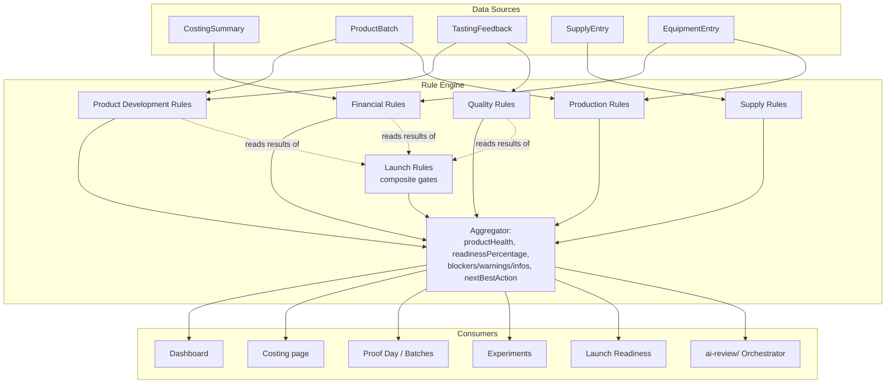

# Aly & Shin Product Lab — Rule Engine

Documentation and architecture only. No application code, no Supabase changes, no UI, no APIs —
see `## Out of scope` at the end for what deliberately isn't here yet.

## Purpose

The Rule Engine is the deterministic foundation for product health, launch readiness, dashboard
status, and notifications. It works completely offline, requires no AI, and is the single source
of truth every other system — including the `ai-review/` AI Review Framework — reads from
instead of recomputing the same checks independently.

**AI is never required to run these checks. AI consumes the Rule Engine's outputs as evidence;
it does not replace them, recompute them, or override them.** This mirrors exactly how
`ai-review/SPECIALIST_REVIEW_PROTOCOL.md` already instructs specialists never to treat an
app-computed gate as their own judgment — the Rule Engine is the formal version of that same
principle, generalized beyond the six checks `readiness.ts` currently hardcodes.

## Principles

- **Deterministic.** Same inputs always produce the same outputs. No model call, no randomness,
  no judgment calls baked into the engine itself — judgment lives in specialists/humans who
  *read* the output.
- **Never invent a number.** Where Phase 1 of this app's costing work established that yield
  missing means `costPerPiece` is `null` — never zero, never the whole batch cost — the Rule
  Engine generalizes that discipline to every rule: **a rule with insufficient data returns
  `passed: null`, not a guessed pass or fail.** See `## Output Format`.
- **Severity-weighted, not just a pass count.** `readiness.ts`'s existing 6-gate score is a flat
  pass count with no severity weighting — already flagged as a real limitation in
  `ai-review/specialists/business-intelligence-analyst.md`. The Rule Engine's
  `readinessPercentage` fixes this directly (see `## Priority System`).
- **One rule, one job.** A rule doesn't recompute another rule's check — it reads that rule's
  result. LAUNCH-003 doesn't recompute margin; it reads FIN-001's result. This keeps the "one
  source of truth" discipline the rest of this repo already follows (see `src/lib/costing.ts`'s
  `getCostingMetrics` being the single place margin math lives).
- **Appropriate to the current stage.** No rule in this design assumes multi-branch operations,
  high-volume purchasing, or infrastructure inappropriate for a home-proofing business — matching
  `PRODUCT_LAB_CONTEXT.md`'s own stated priorities.

## Data Sources

The Rule Engine reads existing app entities — it does not require new tables or fields to start
producing useful output, though several rules note real data gaps (no dedicated shelf-life-test
or experiment-tracking fields exist yet — see the relevant `RULES/*.md` files for exactly which
rules are affected and how they degrade gracefully to `passed: null` instead of guessing).

| Entity | Source | Feeds |
|---|---|---|
| `CostingSummary` + `getCostingMetrics`/`getCostingTotals` | `src/lib/costing.ts` | Financial rules |
| `ProductBatch` | `product_batches` table | Product Development, Production rules |
| `TastingFeedback` | `tasting_feedback` table | Product Development, Quality rules |
| `SupplyEntry` + `getMatchingSupplies`/`getSupplySortTime` | `src/lib/supplies.ts` | Supply rules |
| `EquipmentEntry` | `equipment` table | Financial (indirect cost), Production rules |

## Rule Categories

Full rule definitions live under `RULES/` — one file per category, each rule in the same
12-field template (Rule ID, Name, Purpose, Inputs, Evaluation Logic, Pass/Warning/Fail Criteria,
Severity, Output Message, Suggested Next Action).

| File | Category | Rules | Default priority weight |
|---|---|---|---|
| `RULES/financial.md` | Financial | FIN-001…FIN-007 | 7 (highest) |
| `RULES/quality.md` | Quality | QUAL-001…QUAL-005 | 6 for food safety (QUAL-005), 5 for the rest |
| `RULES/supply.md` | Supply | SUP-001…SUP-004 | 4 |
| `RULES/production.md` | Production | PROD-001…PROD-005 | 3 |
| `RULES/product-development.md` | Product Development | DEV-001…DEV-006 | 2 |
| `RULES/launch.md` | Launch (composite gates) | LAUNCH-001…LAUNCH-004 | not ranked — see below |

Launch Rules don't carry their own priority weight because they don't compete with normal rules
for `nextBestAction` — they aggregate other rules' results and only run when a launch decision is
actually being evaluated. See `RULES/launch.md`.

## Output Format

### Per-rule result

```ts
type RuleSeverity = "info" | "warning" | "blocker";

type RuleResult = {
  id: string;            // e.g. "FIN-001"
  category: "financial" | "product-development" | "production" | "quality" | "supply" | "launch";
  severity: RuleSeverity;
  passed: boolean | null; // null = insufficient data to evaluate, NOT a failure
  message: string;        // filled-in Output Message template
  recommendation: string; // filled-in Suggested Next Action template
};
```

`passed: null` is a first-class result, not an error state — a rule engine that can't tell the
difference between "this failed" and "this was never measured" produces exactly the kind of
false confidence this whole framework (and this app's Phase 1 costing fix) exists to prevent.

### Engine-level result

```ts
type RuleEngineResult = {
  productHealth: "ready" | "on-track" | "at-risk" | "blocked";
  readinessPercentage: number;       // 0-100, severity-weighted, see below
  blockers: RuleResult[];            // passed === false, severity === "blocker"
  warnings: RuleResult[];            // passed === false, severity === "warning"
  infos: RuleResult[];               // passed === false, severity === "info"
  insufficientData: RuleResult[];    // passed === null — kept separate, never silently dropped
  nextBestAction: RuleResult | null; // the single highest-priority item, or null if nothing is failing
};
```

`insufficientData` is not in the user-facing spec's four buckets but is included here
deliberately — burying "we don't actually know" inside `infos` would violate the "never invent a
number" principle above. Every consumer should be able to tell "no issue found" apart from
"couldn't check."

### `productHealth` derivation

- **`blocked`** — at least one active Blocker.
- **`at-risk`** — no Blockers, at least one active Warning.
- **`on-track`** — no Blockers or Warnings; only Infos and/or InsufficientData remain.
- **`ready`** — every applicable rule passes, including all Launch Rules (only meaningful when
  evaluated in a launch context).

## Priority System

### Category weights (default)

Financial `7` > Quality/Food-Safety (QUAL-005 specifically) `6` > Quality/other `5` > Supply `4`
> Production `3` > Product Development `2`. This directly encodes the example ordering given in
this design's brief: *Financial blocker > Food safety blocker > Shelf-life blocker > Production
warning > Documentation warning.*

### Priority score

```
priorityScore = (severityRank × 1000) + (categoryWeight × 10) + ruleSpecificTiebreak
```

Where `severityRank`: blocker = `3`, warning = `2`, info = `1`. This guarantees **any Blocker
outranks every Warning, and any Warning outranks every Info, regardless of category** — a
Documentation Warning never outranks a Production Blocker, but a Financial Blocker always
outranks a Food-Safety Warning. Category weight only breaks ties *within* the same severity tier.
`ruleSpecificTiebreak` is a small per-rule integer (0-9) for ordering within the same
category+severity, e.g. FIN-001 (negative margin, the worst case) ranks above FIN-002 (food cost
%, a softer symptom of the same problem) even though both are Financial.

### `nextBestAction`

The single `RuleResult` with the highest `priorityScore` among all Blockers, Warnings, and Infos
(never a Pass, never an InsufficientData result — those don't need action). If nothing is
failing, `nextBestAction` is `null` and `productHealth` is `on-track` or `ready`.

### `readinessPercentage`

Weighted, not a flat pass count — this is the direct fix for the limitation already flagged in
`ai-review/specialists/business-intelligence-analyst.md` about `readiness.ts`'s unweighted score.

```
weight(rule) = 3 if defaultSeverity === "blocker", 2 if "warning", 1 if "info"
readinessPercentage = 100 × Σ weight(passed rules) / Σ weight(applicable rules)
```

**Rules with `passed: null` (insufficient data) are excluded from both the numerator and
denominator** — a product isn't penalized for evidence that simply hasn't been collected yet.
Only rules that were actually evaluated (pass or fail) count toward the percentage. See the
worked Brownies example below for a fully computed instance of this formula.

## Integration

How each consumer uses the Rule Engine — none of them recompute rule logic themselves, they call
the engine and render/react to its output.

- **Dashboard.** Renders `productHealth` and `nextBestAction` per product, and can aggregate
  `nextBestAction` across all products to answer "what's the single most valuable thing to do
  right now" business-wide, not just per-product. This directly replaces the currently-orphaned
  Closest-to-Launch/Pause-Candidates/Needs-Review logic in `readiness.ts` with a severity-aware
  equivalent.
- **Costing.** Runs Financial rules live as the user edits a costing (the same way `costPerPiece`
  etc. already update live via `getCostingMetrics`) — FIN-001 through FIN-007 become inline
  validation, not just a dashboard summary.
- **Recipes / Proof Day.** Runs Product Development and Production rules as batches are logged —
  DEV-005 (recipe locked) and PROD-002 (yield consistency) are naturally evaluated the moment a
  new batch is saved.
- **Experiments.** DEV-004 (experiment completion) and the shelf-life/temperature Quality rules
  read the same structured experiment data
  `ai-review/workflows/product-experiment-design.md` recommends recording — the workflow's output
  *is* this rule category's input.
- **Launch Readiness.** Runs the full rule set plus `RULES/launch.md`'s composite gates. This is
  the direct replacement for `readiness.ts`'s current 6-check `getReadinessScore` — same
  underlying purpose, but severity-weighted and gap-aware instead of a flat boolean count.
- **AI Review Framework (`ai-review/`).** The Orchestrator and every specialist module read
  `RuleEngineResult` as their **"App gate result"** evidence (see
  `ai-review/ORCHESTRATOR.md` step 6) — they never recompute margin, yield, or any other
  deterministic check themselves. A specialist's job is to interpret and add judgment the engine
  structurally can't provide (is 149.52 a realistic price for this market; does a repeated
  `wentWrong` note actually indicate a process problem) — never to re-derive what the engine
  already computed. Concretely: `ORCHESTRATOR.md`'s "App gate result" step now means "call the
  Rule Engine, read `RuleEngineResult`," not "manually check `readiness.ts`'s 6 booleans."

## Out of scope (this document)

No application code, no Supabase schema changes, no UI, no API endpoints. Several rules note real
data gaps (no dedicated experiment/shelf-life-test schema fields exist yet) — those gaps are
described, not filled, here. Implementing the engine itself, and any schema work a future rule
genuinely needs, is a separate, later task.

---

## Final Section

### 1. Architecture diagram



### 2. Rule execution flow

1. Caller requests an evaluation for a product, optionally scoped to a context (`"routine"` for
   dashboard/costing-page use, or `"launch"` to also run `RULES/launch.md`'s composite gates).
2. Engine loads that product's current data across all five source entities (one read pass, not
   per-rule queries).
3. Each category's rules run independently against that shared data snapshot — no rule depends
   on another rule's *execution order*, only on another rule's *result* (Launch Rules read
   already-computed results from step 3, they don't trigger re-evaluation).
4. Every rule returns exactly one `RuleResult`, including `passed: null` where data is
   insufficient — no rule is silently skipped without a result.
5. Aggregator buckets results into blockers/warnings/infos/insufficientData, computes
   `priorityScore` for every non-passing, non-null result, and selects `nextBestAction` as the
   single highest-scoring one.
6. Aggregator computes `readinessPercentage` from applicable (non-null) rules only, and derives
   `productHealth` from the bucket contents.
7. Engine returns one `RuleEngineResult`. Consumers render or act on it; none of them re-run
   rule logic themselves.

### 3. Example output for Brownies

Using the real costing exported from this app on 2026-07-22 (`brownies-costing.csv` /
`Brownies costing v1.pdf`, recovered earlier this session) — ingredients PHP 233.66, packaging
PHP 10 (Box only, no test note), labor PHP 120 (60 real active minutes logged), water PHP 35,
waste PHP 20, overhead PHP 0 (noted "at home for now"), equipment PHP 0 (no note), yield 8,
selling price PHP 50 → cost per piece PHP 52.33, margin **-4.7%**. Batch, tasting, and most
Quality/Production evidence for Brownies was not retrievable this session (confirmed Missing —
see the earlier Brownies readiness review) and is shown as `passed: null` below, not guessed at.

```json
{
  "product": "brownies",
  "context": "routine",
  "evaluatedAt": "2026-07-22",
  "productHealth": "blocked",
  "readinessPercentage": 63,
  "nextBestAction": {
    "id": "FIN-001",
    "category": "financial",
    "severity": "blocker",
    "passed": false,
    "message": "Brownies costs PHP 52.33 to make but sells for PHP 50.00 — losing PHP 2.33 on every piece sold.",
    "recommendation": "Raise the price to at least PHP 52.33 (breakeven), or reduce a specific cost driver — cocoa powder + dark chocolate compound are PHP 95.50 of the PHP 233.66 ingredient total."
  },
  "blockers": [
    { "id": "FIN-001", "category": "financial", "severity": "blocker", "passed": false,
      "message": "Margin is -4.7% at the current price.", "recommendation": "See nextBestAction." }
  ],
  "warnings": [
    { "id": "FIN-002", "category": "financial", "severity": "warning", "passed": false,
      "message": "Food cost is 104.7% against a 35% target — 69.7 points over.",
      "recommendation": "Same underlying fix as FIN-001; not double-counted as a second blocker." },
    { "id": "FIN-006", "category": "financial", "severity": "warning", "passed": false,
      "message": "Break-even can't be calculated — contribution margin is negative (price is below variable cost per piece).",
      "recommendation": "Resolve FIN-001 first; break-even is meaningless until price covers variable cost." },
    { "id": "QUAL-002", "category": "quality", "severity": "warning", "passed": false,
      "message": "Packaging cost is PHP 10.00 (Box only) but no test note confirms it holds up under real delivery conditions.",
      "recommendation": "Run a packaging stress test (see ai-review/knowledge/packaging.md) and log the result." }
  ],
  "infos": [],
  "insufficientData": [
    { "id": "DEV-001", "category": "product-development", "severity": "blocker", "passed": null,
      "message": "Proof batch count for Brownies could not be retrieved this session.",
      "recommendation": "Confirm current batch count on the Batches page." },
    { "id": "DEV-002", "category": "product-development", "severity": "blocker", "passed": null,
      "message": "Tasting count/average rating could not be retrieved this session.",
      "recommendation": "Confirm on the Product Detail page." },
    { "id": "PROD-002", "category": "production", "severity": "warning", "passed": null,
      "message": "Yield-consistency history could not be retrieved this session.",
      "recommendation": "Requires 3+ logged batches to evaluate." },
    { "id": "QUAL-001", "category": "quality", "severity": "blocker", "passed": null,
      "message": "Shelf-life checkpoint data could not be retrieved this session.",
      "recommendation": "Log a 24h/48h checkpoint per the experiment-design workflow." }
  ]
}
```

**How `readinessPercentage` = 63% was computed** (applicable rules only — 10 of the 31 total
rules could be evaluated with the data actually available; the rest are `insufficientData` and
excluded, not scored as failing):

| Rule | Default severity (weight) | Result |
|---|---|---|
| PROD-001 Yield entered | blocker (3) | pass |
| FIN-005 Selling price set | blocker (3) | pass |
| SUP-001 Supplier matched | blocker (3) | pass |
| FIN-001 Negative margin | blocker (3) | **fail** |
| FIN-002 Food cost % | warning (2) | fail |
| FIN-003 Labor entered | warning (2) | pass |
| FIN-004 Overhead entered | warning (2) | pass |
| FIN-006 Break-even | warning (2) | fail |
| SUP-002 Ingredient availability | warning (2) | pass |
| QUAL-002 Packaging validation | warning (2) | fail |

`Σ weight(passed)` = 3+3+3+2+2+2 = 15. `Σ weight(applicable)` = 15 + (3+2+2+2) = 24.
`15 / 24 × 100 = 62.5` → **63%**.

### 4. Suggested implementation order

1. **Financial rules (FIN-001…007).** The underlying math already exists and is correct
   (`getCostingMetrics`/`getCostingTotals`, Phase 1/2 of this app's costing work) — this phase is
   almost entirely "wrap existing functions in the `RuleResult` shape," the lowest-risk starting
   point.
2. **Product Development rules DEV-001/DEV-002** (batches, tastings) — `readiness.ts` already
   computes these two checks; wrap them the same way.
3. **Supply rules (SUP-001…004).** `getMatchingSupplies`/`getSupplySortTime` already exist in
   `src/lib/supplies.ts` from this session's Phase 1 work — same "wrap, don't reinvent" pattern.
4. **Production rules (PROD-001…005).** PROD-001 (yield) is effectively already covered by
   Financial's dependency on it; PROD-002-005 need new aggregation logic across batch history
   (not just single-record reads) — moderate new work.
5. **Remaining Product Development rules (DEV-003…006).** Mostly free-text-based today
   (`wentWrong`/`improveNext`) — implementable, but lower-value until batch volume is higher.
6. **Quality rules (QUAL-001…005).** Highest new-build cost — no dedicated schema fields exist
   for shelf-life/temperature tests yet, so this phase includes deciding whether to add them
   (a future, separate task) or keep evaluating free text.
7. **Launch composite gates (LAUNCH-001…004).** Trivial once the rules they aggregate exist —
   pure aggregation logic, no new data reads.
8. **Priority system + aggregator** (`nextBestAction`, `readinessPercentage`,
   `productHealth`) — can actually be built in parallel with step 1, since the scoring/bucketing
   logic doesn't care which rules exist yet, only that they conform to the `RuleResult` shape.

### 5. MVP rule set

For a first working version: **all of Financial (FIN-001…007), DEV-001, DEV-002, and the
aggregator/priority system.** This alone would have caught the real Brownies margin problem found
this session, is the fastest to build (steps 1, 2, and 8 above), and immediately gives the
Dashboard and Costing page a real `nextBestAction` — the highest-value, lowest-effort slice of
the whole design. Everything else can ship incrementally without changing this MVP's output
shape.
