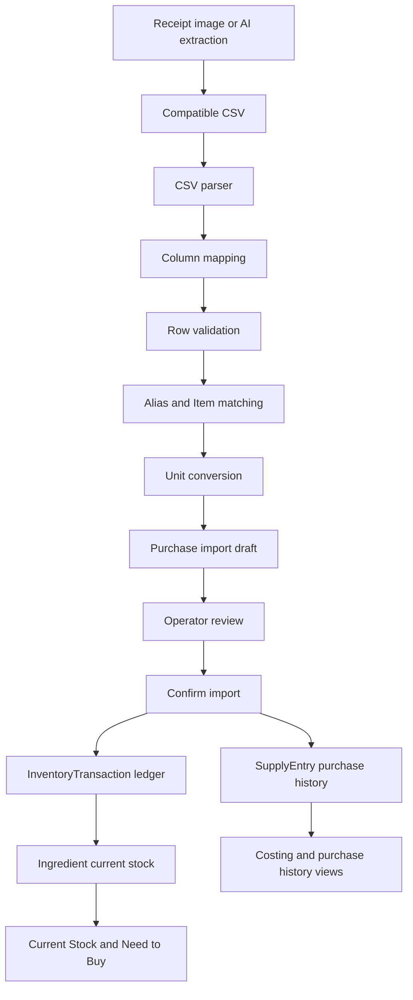

# Purchase Import Guide

This guide explains how receipt CSV imports become purchase history and inventory stock.

The importer is designed around one canonical inventory object:

- `Ingredient` is the Item the business manages.
- `SupplyEntry` is one purchase-history record attached to an Item.
- `InventoryTransaction` is the stock ledger record created when an import is confirmed.

## Recommended CSV Format

Use one row per purchased receipt line.

```csv
item_name,brand,package_count,package_size,package_unit,unit_price,category,supplier,receipt_number,purchase_date,expiration_date
Classic Cocoa Powder,Beryl's,1,1000,g,862.20,ingredient,Chef's and Bakers,SI-10442,2026-07-24,
Instant Coffee,S&R Member's Value,1,200,g,179.00,ingredient,S&R,OR-88421,2026-07-24,
Egg,Selection by Landers,12,1,pcs,8.50,ingredient,Landers,OR-88421,2026-07-24,
```

Best practices for AI receipt extraction:

- Keep `item_name` clean. Put brand in `brand`, not inside the item name, when possible.
- If using package columns, put package size in `package_size` and `package_unit`, not only in `item_name`.
- Use plain decimal numbers only. Do not include currency symbols or commas.
- Use ISO dates: `YYYY-MM-DD`.
- Any of `g`, `kg`, `ml`, `L`, `pcs` works as a receipt unit -- kg/L are converted into the matched
  Item's own canonical unit (always `g`, `ml`, or `pcs`; see "Unit Handling" below) before
  affecting stock, the same as any other convertible unit.
- Do not include subtotal, tax, discount, payment method, change, or loyalty rows as inventory items.
- Repeat `supplier`, `receipt_number`, and `purchase_date` on every row for maximum compatibility.

## Roadmap Note: Package Line Totals

The current package-mode importer calculates total cost from:

```txt
package_count * unit_price
```

That means package-mode rows should provide `unit_price` today.

Many POS receipts naturally show a line total instead of a per-package price:

```txt
Butter
2 x 227 g
PHP 360.00
```

A future importer improvement should support this compatible CSV shape:

```csv
item_name,brand,package_count,package_size,package_unit,total_price
Butter,Magnolia,2,227,g,360.00
```

When `unit_price` is missing and `total_price` is present, the importer could derive:

```txt
unit_price = total_price / package_count
total_cost = total_price
```

This would reduce AI guesswork and manual corrections. It is not implemented yet.

## Supported CSV Columns

The importer supports mapped columns. Header matching is case-insensitive and normalizes spaces and hyphens to underscores.

| Column | Required | Type | Example | Validation | Default if missing |
|---|---:|---|---|---|---|
| `item_name` | Yes | string | `Classic Cocoa Powder 200g` | Row invalid if blank | Mapping incomplete or row invalid |
| `brand` | Before confirm | string | `Beryl's` | No parser validation | Reliable latest Item brand if available; otherwise confirmation is blocked |
| `quantity` | Conditional | number | `1000` | Finite and greater than `0` | Required when not using package columns |
| `unit` | Conditional | unit string | `g` | Nonblank and convertible to Item base unit for auto-confirm | Required when not using package columns |
| `total_price` | Optional | number | `862.20` | Finite and greater than or equal to `0` | `0` |
| `expiration_date` | Optional | date string | `2026-09-30` | Must parse as a valid date if present | No expiration update |
| `category` | Optional | string | `ingredient` | Used only when it confidently maps to a known category | Blank |
| `package_count` | Package mode | number | `2` | Blank defaults to `1`; otherwise finite and greater than `0` | `1` when mapped but blank |
| `package_size` | Package mode | number | `500` | Finite and greater than `0` | Row invalid in package mode |
| `package_unit` | Package mode | unit string | `g` | Nonblank and convertible to Item base unit for auto-confirm | If blank, importer uses flat quantity/unit mode |
| `unit_price` | Optional in package mode | number | `431.10` | Finite and greater than or equal to `0` | `0` |
| `supplier` | Optional | string | `Chef's and Bakers` | No parser validation | Import-level supplier, then blank |
| `receipt_number` | Optional | string | `SI-10442` | No parser validation | Import-level receipt number, then blank |
| `purchase_date` | Optional | date string | `2026-07-24` | No draft-level parser validation | Import-level purchase date, then today |

Supported header aliases:

| Field | Accepted headers |
|---|---|
| `itemName` | `item_name`, `item`, `name`, `ingredient`, `product`, `description` |
| `brand` | `brand`, `brand_name`, `manufacturer` |
| `quantity` | `quantity`, `qty`, `amount` |
| `unit` | `unit`, `uom` |
| `totalPrice` | `total_price`, `price`, `total`, `cost`, `amount_php` |
| `expirationDate` | `expiration_date`, `expiry`, `expiry_date`, `exp_date`, `best_before` |
| `category` | `category`, `item_category`, `type` |
| `packageCount` | `package_count`, `pack_count`, `packages`, `qty_packages`, `num_packages` |
| `packageSize` | `package_size`, `pack_size`, `size` |
| `packageUnit` | `package_unit`, `pack_unit`, `size_unit` |
| `unitPrice` | `unit_price`, `price_per_unit`, `price_per_package`, `pack_price` |
| `supplier` | `supplier`, `vendor`, `supplier_name` |
| `receiptNumber` | `receipt_number`, `receipt_no`, `invoice_number`, `invoice_no`, `receipt` |
| `purchaseDate` | `purchase_date`, `date`, `date_bought`, `receipt_date` |

## Import Pipeline

```txt
CSV
-> parser
-> column mapping
-> row validation
-> alias / Item matching
-> unit conversion
-> purchase import draft
-> operator confirmation
-> SupplyEntry purchase history
-> InventoryTransaction ledger
-> Ingredient current stock
```

| Step | Module | Responsibility |
|---|---|---|
| CSV parsing | `src/lib/csv-parser.ts` | Reads headers and rows, supports quoted cells, trims headers and cells |
| Column mapping | `src/lib/csv-column-mapping.ts` | Maps CSV headers to importer fields using aliases or manual mapping |
| Row validation | `src/lib/purchase-import.ts` | Validates item name, quantity/package fields, price, and expiration date |
| Item matching | `src/lib/ingredient-matching.ts` | Resolves alias, exact, normalized, or suggested Item matches |
| Unit conversion | `src/lib/unit-conversion.ts` | Converts imported quantity into the matched Item's base unit |
| Draft persistence | `src/app/product-lab.tsx` | Saves `purchase_imports` and `purchase_import_rows`, or localStorage equivalents |
| User resolution | `PurchaseImportWizard` | Lets the operator assign Items, brands, categories, quantity overrides, and exclusions |
| Confirmation | `src/app/product-lab.tsx` | Calls confirmation helpers and Supabase/local persistence |
| Purchase history | `src/lib/purchase-import-confirm.ts` | Creates one `SupplyEntry` per confirmed CSV row |
| Inventory ledger | `src/lib/purchase-import-confirm.ts` | Creates one grouped `InventoryTransaction` per affected Item |
| Current stock | Ingredient state | Adds converted quantities to `Ingredient.currentQuantity` |

## Field Effects

| CSV field | Stored permanently | Affects costing | Affects stock |
|---|---:|---:|---:|
| `item_name` | Yes, on import row and `SupplyEntry.ingredientName` | Indirectly through Item association | Indirectly through Item association |
| `brand` | Yes, on import row and `SupplyEntry.brandName` | Yes, as purchase-level history/filter context | No |
| `quantity` | Yes, raw and parsed | Yes | Yes |
| `unit` | Yes | Yes | Yes, when convertible |
| `total_price` | Yes | Yes | No |
| `expiration_date` | Yes on import row; may update Item nearest expiration | No | No |
| `category` | Yes on import row; added to purchase notes | No | No |
| `package_count` | Yes, raw and parsed | Yes | Yes |
| `package_size` | Yes, raw and parsed | Yes | Yes |
| `package_unit` | Yes | Yes | Yes, when convertible |
| `unit_price` | Yes, raw and parsed | Yes | No |
| `supplier` | Yes, on import row and `SupplyEntry.supplierName` | Display/filter context | No |
| `receipt_number` | Yes on import row; added to purchase notes | No | No |
| `purchase_date` | Yes, on import row and `SupplyEntry.purchaseDate` | Yes, for latest/recent purchase logic | No |

## Item Matching

Matching order:

1. Alias match
2. Exact active Item name match
3. Normalized active Item name match
4. Suggested partial match
5. No match

Alias matching compares trimmed lowercase imported text to saved alias text.

Exact matching compares trimmed lowercase imported text to active Item names.

Normalized matching:

- Lowercases the text.
- Removes common package sizes such as `200g`, `1 kg`, or `475ml`.
- Replaces punctuation with spaces.
- Collapses whitespace.

Suggested partial matches are not automatically confirmed. The operator must confirm or correct them.

`ingredientId` is the durable association after a row is matched or manually assigned. Brand never determines Item identity.

## Unit Handling

An Item's own `baseUnit` is always one of the three **canonical units** -- `g` (mass), `ml`
(volume), or `pcs` (count); see `CANONICAL_UNITS` in `src/lib/product-lab-types.ts`. `kg` and `L`
are receipt/recipe **input units only** -- always valid to type on a CSV row, always converted
into the matched Item's canonical unit before ever affecting stock.

Recognized unit spellings, normalized before matching or converting:

| Normalized form | Accepted inputs |
|---|---|
| `g` | `g`, `gram`, `grams` |
| `kg` | `kg`, `kilogram`, `kilograms` |
| `ml` | `ml`, `milliliter`, `milliliters`, `millilitre`, `millilitres` |
| `L` | `l`, `liter`, `liters`, `litre`, `litres` |
| `pcs` | `pcs`, `pc`, `piece`, `pieces`, `each`, `ea` |
| `tbsp` | `tbsp`, `tablespoon`, `tablespoons` |
| `tsp` | `tsp`, `teaspoon`, `teaspoons` |
| `cup` | `cup`, `cups` |

Automatic conversions (`unit-conversion.ts`'s `convertUnit`, the same primitive every other
inventory-mutation path and Costing's supplier matching share):

| From | To | Factor |
|---|---|---:|
| `g` | `kg` | `0.001` |
| `kg` | `g` | `1000` |
| `ml` | `L` | `0.001` |
| `L` | `ml` | `1000` |
| `tbsp` | `ml` | `15` |
| `tbsp` | `L` | `0.015` |
| `tsp` | `ml` | `5` |
| `tsp` | `L` | `0.005` |
| `cup` | `ml` | `240` |
| `cup` | `L` | `0.24` |

Unsupported conversions, such as mass to volume or volume to mass, leave the row pending for
operator correction -- never guessed at, regardless of which canonical unit the matched Item uses.

## Purchase History Records

Each confirmed non-excluded CSV row creates one `SupplyEntry`.

Stored fields:

| SupplyEntry field | Source |
|---|---|
| `id` | Generated UUID |
| `ingredientId` | Matched or manually selected Item ID |
| `ingredientName` | Current Item name if found; otherwise raw CSV item name |
| `brandName` | CSV brand, reliable brand fallback, or operator-entered brand |
| `supplierName` | Row supplier, then import-level supplier |
| `purchaseDate` | Row purchase date, then import-level purchase date, then today |
| `createdAt` | Confirmation timestamp |
| `packQuantity` | Parsed quantity, flat or package-derived |
| `unit` | Package unit if package mode; otherwise flat unit |
| `totalCost` | Parsed total price |
| `qualityRating` | Default `0` |
| `notes` | Generated import note, category, and receipt number |

Import-only fields such as match method, row status, exclusion reason, validation errors, converted quantity, and expiration date are not stored as `SupplyEntry` fields.

## Inventory Transactions

Inventory transactions are created only when the import is confirmed.

Confirmed rows are grouped by `ingredientId`. The importer creates one purchase ledger transaction per affected Item.

| InventoryTransaction field | Value |
|---|---|
| `ingredientId` | Matched Item ID |
| `transactionType` | `purchase` |
| `quantityChange` | Sum of converted quantities for that Item |
| `quantityBefore` | Item current quantity before import |
| `quantityAfter` | Before plus added quantity |
| `sourceType` | `purchase_import` |
| `sourceId` | Purchase import ID |
| `note` | Empty string |
| `createdAt` | Confirmation timestamp |

The CSV never directly supplies ledger identity, transaction type, quantity before, quantity after, source type, or source ID.

## Validation And Error Handling

| Failure | Handling |
|---|---|
| Missing required column mapping | Import cannot proceed until mapping is complete |
| Blank item name | Row is invalid |
| Missing quantity in flat mode | Row is invalid |
| Invalid or non-positive quantity | Row is invalid |
| Missing unit in flat mode | Row is invalid |
| Invalid or negative total price | Row is invalid |
| Invalid expiration date | Row is invalid |
| Invalid or non-positive package count | Row is invalid |
| Missing package size in package mode | Row is invalid |
| Invalid or non-positive package size | Row is invalid |
| Missing package unit in package mode | Row is invalid |
| Invalid or negative unit price | Row is invalid |
| Unknown Item | Row remains pending |
| Suggested Item match | Row remains pending until confirmed |
| Unsupported unit conversion | Row remains pending |
| Missing brand on matched row | Confirmation is blocked |
| Unresolved row at confirmation | Confirmation is blocked |
| All rows excluded | Confirmation is blocked |
| Import not found | Confirmation fails |
| Import already confirmed or discarded | Confirmation fails |

Duplicate rows are not automatically rejected. If the same receipt line appears twice, both rows can become purchase records and affect stock unless the operator excludes one.

## Architecture Diagram


